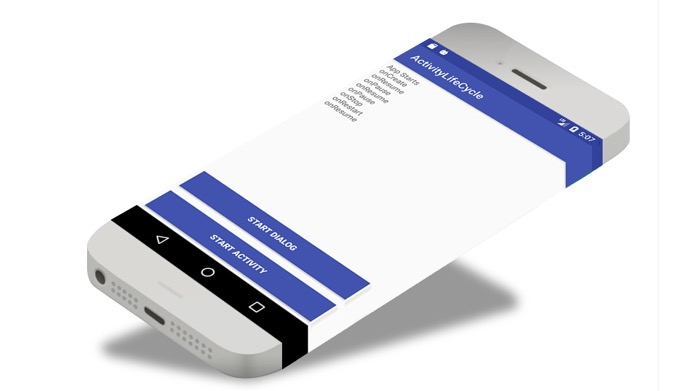

## Android activity lifecycle



An activity serves as the entry point for an app's interaction with the user.  It is a crucial component of an Android application, and the way activities are launched and put together is a fundamental part of the platform's application model [[1](https://developer.android.com/guide/components/activities/intro-activities.html)].
In a given app, most of the time, a user will have to navigate through different activities. During such interaction, the Activity instances in the app transition through various states in their lifecycle[ [2](https://developer.android.com/guide/components/activities/activity-lifecycle.html)].
We, as a developer can intervene during this different states using the six (6)callbacks that the Activity class provides:  onCreate(), onStart(), onResume(), onPause(), onStop(), and onDestroy().

This application shows a log output each time the main activity changes state. 


As you could notice, we have two buttons and here is how we set the onClick listener.

(image)

Now that we have the onClick listener on the button, we can use an Intent to connect this activity to start another activity.

(image)

#### The manifest file

Every Android application must have an AndroidManifest.xml file in its root directory. 
The manifest file provides essential information about your app to the Android operating system (OS). The information contained in the Manifest file is a pre-requisite before the OS can run any of the application`s code.

The manifest file contains the following among others:
The application package name
The application components: activities, services, broadcast receivers, and content providers.
The list of permissions required by the application

It is important to note that all visible activities of the application should explicitly be declared in the manifest file.
For example, in this application, we have three activities namely, Activity, Dialog, and MainActivity; and they are all explicitly declared in the manifest file.


```xml
<?xml version="1.0" encoding="utf-8"?>
<manifest xmlns:android="http://schemas.android.com/apk/res/android"
    package="mg.studio.activitylifecycle">

    <application
        android:allowBackup="true"
        android:icon="@mipmap/ic_launcher"
        android:label="@string/app_name"
        android:roundIcon="@mipmap/ic_launcher_round"
        android:supportsRtl="true"
        android:theme="@style/AppTheme">
        <activity android:name=".MainActivity">
            <intent-filter>
                <action android:name="android.intent.action.MAIN" />

                <category android:name="android.intent.category.LAUNCHER" />
            </intent-filter>
        </activity>
        <activity android:name=".Activity"/>
        <activity android:name=".Dialog"
            android:theme="@style/Theme.AppCompat.Dialog"/>
    </application>

</manifest>

```

Here is the complete java code for the MainActivity class where we can find all the overrides for the different lifecycle callbacks.


```java
package mg.studio.activitylifecycle;

import android.content.Intent;
import android.support.v7.app.AppCompatActivity;
import android.os.Bundle;
import android.util.Log;
import android.view.View;
import android.widget.TextView;

public class MainActivity extends AppCompatActivity {

    private final String TAG = getClass().getSimpleName();
    private String previousContent;
    private String currentState = null;

    @Override
    protected void onCreate(Bundle savedInstanceState) {
        super.onCreate(savedInstanceState);
        setContentView(R.layout.activity_main);

        Log.d(TAG, "onCreate:" + TAG);
        currentState = "onCreate";
        setText();


        findViewById(R.id.btn_start_activity).setOnClickListener(new View.OnClickListener() {
            @Override
            public void onClick(View view) {
                Intent mIntent = new Intent(getBaseContext(), Activity.class);
                startActivity(mIntent);

            }
        });

        findViewById(R.id.btn_start_dialog).setOnClickListener(new View.OnClickListener() {
            @Override
            public void onClick(View view) {
                startActivity(new Intent(getBaseContext(), Dialog.class));
            }
        });


    }


    @Override
    protected void onResume() {
        super.onResume();
        Log.d(TAG, "onResume: " + TAG);
        currentState = "onResume";
        setText();
    }

    @Override
    protected void onRestart() {
        super.onRestart();
        Log.d(TAG, "onRestart: " + TAG);
        currentState = "onRestart";
        setText();
    }

    @Override
    protected void onPause() {
        super.onPause();
        Log.d(TAG, "onPause: " + TAG);
        currentState = "onPause";
        setText();
    }

    @Override
    protected void onStop() {
        super.onStop();
        Log.d(TAG, "onStop: " + TAG);
        currentState = "onStop";
        setText();

    }

    @Override
    protected void onDestroy() {
        super.onDestroy();
        Log.d(TAG, "onDestroy: " + TAG);
        currentState = "onDestroy";
        setText();
    }

    private void setText() {
        previousContent = ((TextView) findViewById(R.id.display)).getText().toString();

        ((TextView) findViewById(R.id.display)).setText(previousContent + "\n" + currentState);
    }

}

```