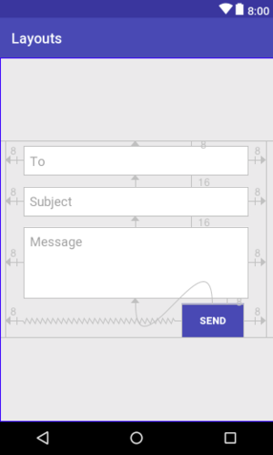

Practicing LinearLayout and RelativeLayout

The design in the LinearLayout above was update to get this

here is the code

See if you can is to implement an improved version of the above using a ConstraintLayout combined with a ScrollView, a RelativeLayout and a LinearLayout if all needed. You final result should look like this

   

