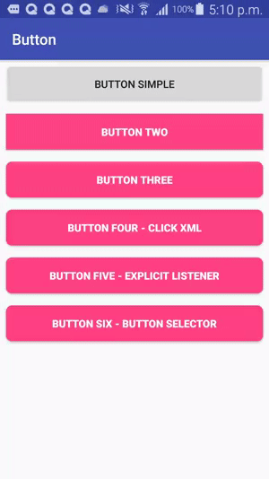

# Android button design

It comes handy to have sample button designs. Here are 6 core designs which I find foundational:
1. [Button simple: simple standard design](#button-simple-simple-standard-design)
2. [Button Two: with specific colors](#button-two-with-specific-colors)
3. Button Three: color and rounded corners
4. Button four: clickable from the XML file
5. button five: explicit onclick listener in the java file
6. button six: adding selectors to change color when the button is pressed




1. Button simple: simple standard design


```xml
    <Button
        android:id="@+id/btn_simple"
        android:layout_width="match_parent"
        android:layout_height="wrap_content"
        android:text="Button simple"
        android:layout_margin="8dp"/>
```

2. Button Two: with specific colors

```xml
    <Button
        android:id="@+id/btn_two"
        android:layout_width="match_parent"
        android:layout_height="wrap_content"
        android:text="Button two"
        android:layout_margin="8dp"
        android:elevation="24dp"
        android:background="@color/colorAccent"
        android:textColor="@android:color/white"
        android:textStyle="bold" />

```

### Button Three: color and rounded corners

Create button_shape.xml to specify the shape and color of the button. Save it to your drawable folder.

```xml
<?xml version="1.0" encoding="utf-8"?>
<shape xmlns:android="http://schemas.android.com/apk/res/android"
    android:shape="rectangle">
    <solid android:color="@color/colorAccent" />
    <corners android:radius="8dp" />
</shape>
```
Here is the button

```xml
    <Button
        android:id="@+id/btn_three"
        android:layout_below="@+id/btn_two"
        android:layout_width="match_parent"
        android:layout_height="wrap_content"
        android:text="Button Three"
        android:layout_margin="8dp"
        android:background="@drawable/button_shape"
        android:textColor="@android:color/white"
        android:textStyle="bold" />
```

### Button four: clickable from the xml file

```xml
    <Button
        android:id="@+id/btn_four"
        android:layout_width="match_parent"
        android:layout_height="wrap_content"
        android:text="Button Four - click xml"
        android:layout_margin="8dp"
        android:background="@drawable/button_shape"
        android:textColor="@android:color/white"
        android:textStyle="bold"
        android:onClick="bntXml"/>
```

Here is an example method we can use in the Java class

```java
    public void bntXml(View view) {
        Toast.makeText(this, ((Button)findViewById(R.id.btn_four)).getText(),Toast.LENGTH_LONG).show();
    }
```


### button five: explicit onclick listener in the java file

```xml
    <Button
        android:id="@+id/btn_five"
        android:layout_width="match_parent"
        android:layout_height="wrap_content"
        android:text="Button Five - explicit listener"
        android:layout_margin="8dp"
        android:background="@drawable/button_shape"
        android:textColor="@android:color/white"
        android:textStyle="bold"/>
```
here is an example of the java class activity

```java

public class MainActivity extends AppCompatActivity {

    @Override
    protected void onCreate(Bundle savedInstanceState) {
        super.onCreate(savedInstanceState);
        setContentView(R.layout.activity_main);

        //Button Five
        findViewById(R.id.btn_five).setOnClickListener(new View.OnClickListener() {
            @Override
            public void onClick(View view) {
                Toast.makeText(getBaseContext(), ((Button)findViewById(R.id.btn_five)).getText(),Toast.LENGTH_LONG).show();
            }
        });
    }
}

```

### button six: adding selectors to change color when the button is pressed

Create a button selector file to specify what to do when the button is pressed. 

```xml
<?xml version="1.0" encoding="utf-8"?>
<selector xmlns:android="http://schemas.android.com/apk/res/android">
    <!--When the button is pressed-->
    <item android:drawable="@drawable/button_shape_pressed"
        android:state_pressed="true" />
    <!--Default-->        
    <item android:drawable="@drawable/button_shape" />
</selector>

```
Notice that I have also created button_shape_pressed which specifies the shape and color of the button when pressed.

```xml
<?xml version="1.0" encoding="utf-8"?>
<shape xmlns:android="http://schemas.android.com/apk/res/android"
    android:shape="rectangle">
    <solid android:color="@color/colorPrimaryDark" />
    <corners android:radius="8dp" />
</shape>
```

here is the button

```xml
 <Button
        android:id="@+id/btn_six"
        android:layout_width="match_parent"
        android:layout_height="wrap_content"
        android:text="Button Six - button selector"
        android:layout_margin="8dp"
        android:background="@drawable/button_selector"
        android:textColor="@android:color/white"
        android:textStyle="bold"/>
```