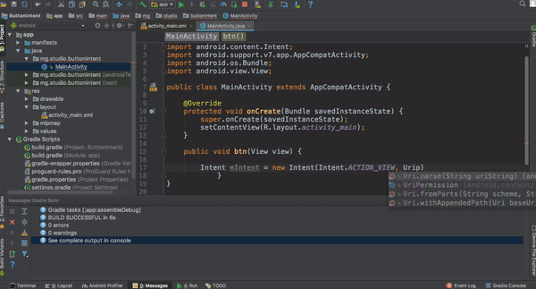

# An intent for opening a website in a browser


An intent is an abstract description of an operation to be performed. 
It can be used with startActivity to launch an Activity: Intent starts an activity

An Intent is mainly used for the launching of activities, where it can be thought of as
the connector between activities. [source](https://developer.android.com/reference/android/content/Intent.html)

The primary pieces of information in an intent are:

action -- The general action to be performed, such as ACTION_VIEW, ACTION_EDIT, ACTION_MAIN, etc.

data -- The data to operate on, such as a person record in the contacts database, expressed as a Uri.




In this demo, an Intent is used to open the page stduio.mg in a browser

```java
        Intent mIntent = new Intent(Intent.ACTION_VIEW, Uri.parse("https:studio.mg"));
        startActivity(mIntent);
```