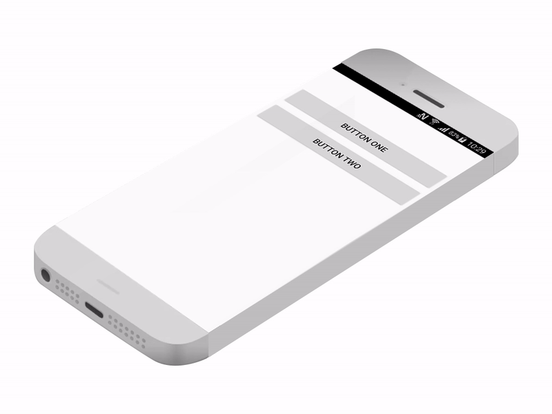

# Two ways of handling clicks (taps) on buttons





- Using the xml layout to set the ```onClick```

- Adding the on ```setOnClickListener``` in the java file.

See the code for the implementation:


### Option one:

```java
// Button One
        (findViewById(R.id.btn)).setOnClickListener(new OnClickListener() {

            @Override
            public void onClick(View v) {
                startActivity(new Intent(getBaseContext(), SecondActivity.class));
            }
        });

```

### Option Two

```java
  // Button two
    public void btn_two(View view) {
        startActivity(new Intent(getBaseContext(), SecondActivity.class));

    }
```

for this latter, you need to add ```android:onClick="btn_two"``` to the xml layout.

```xml

    <Button
        android:id="@+id/btn_two"
        android:layout_width="match_parent"
        android:layout_height="wrap_content"
        android:layout_marginTop="16dp"
        android:onClick="btn_two"
        android:text="Button two" />

```
