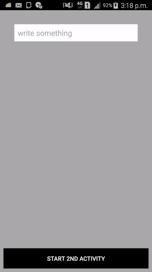

# An intent for starting another activity while passing information at the same time.





```java

public class MainActivity extends Activity {

    @Override
    protected void onCreate(Bundle savedInstanceState) {
        super.onCreate(savedInstanceState);
        setContentView(R.layout.activity_main);

        final EditText userInput = findViewById(R.id.et_input);
        findViewById(R.id.btn).setOnClickListener(new OnClickListener() {

            @Override
            public void onClick(View v) {
                String information = userInput.getText().toString();
                //Todo: handle the case where information is empty
                Intent intent = new Intent(getApplicationContext(),
                        SecondActivity.class);
                intent.putExtra("shared_data", information);
                startActivity(intent);
            }
        });
    }

}

```

```java
package cn.edu.cqu.buttontoast;

import android.app.Activity;
import android.os.Bundle;
import android.widget.TextView;

public class SecondActivity extends Activity {

    @Override
    protected void onCreate(Bundle savedInstanceState) {
        super.onCreate(savedInstanceState);
        setContentView(R.layout.second_layout);

        Bundle extras = getIntent().getExtras();
        if (extras != null) {
            String retrievedInformation = extras.getString("shared_data");
            TextView display = findViewById(R.id.txtLayout);
            display.setText(retrievedInformation);
        }

    }

}

```

It is good to note that for each Activity you have, you should declare it in your manifest.

```xml
<?xml version="1.0" encoding="utf-8"?>
<manifest xmlns:android="http://schemas.android.com/apk/res/android"
    package="cn.edu.cqu.buttontoast"
    android:versionCode="1"
    android:versionName="1.0" >

    <application
        android:allowBackup="true"
        android:icon="@drawable/ic_launcher"
        android:label="@string/app_name"
        android:theme="@style/AppTheme" >
        <activity
            android:name="cn.edu.cqu.buttontoast.MainActivity"
            android:label="@string/app_name" >
            <intent-filter>
                <action android:name="android.intent.action.MAIN" />

                <category android:name="android.intent.category.LAUNCHER" />
            </intent-filter>
        </activity>
        <activity
            android:name="cn.edu.cqu.buttontoast.SecondActivity"
            android:label="@string/app_name" >
        </activity>
    </application>

</manifest>

```

