# Weather application

For our first Android application, let us design a Weather application. We will first complete the application, then discuss the details later. We will learn by doing.
If we need to specify what we will be doing, here is the list:

天气应用是每个人都在使用的应用，我们的安卓应用学习就从动手制作一个天气应用开始！让我们一起来设计一个十分酷炫的天气应用吧，我们将首先完成它的制作然后再讨论一些细节，整个过程都将由大家亲手完成！
+将我们今天的任务稍微细分一下，主要包括以下这些:

- [Designing the application in Android Studio (前端：在android studio中设计这个应用的界面)](#designing-the-application-in-android-studio)
- [Connecting the application to the Internet and updating the content based on the weather forecast (后端：将应用连上网络并依据天气预报信息对内容进行更新)](#connecting-the-application-to-the-internet-and-updating-the-content-based-on-the-weather-forecast)


# Designing the application in Android Studio
# 前端：在android studio中设计这个应用的界面

Here are the steps:
设计界面主要包含以下步骤:
1. Redraw and slice needed images for the application (重绘(Redraw)并截出(slice)应用所需要的图片)
2. Create a new Android project and complete the core design (创建一个新的安卓项目并完成界面上的核心设计)
3. Refine the design and refactor the code (进一步润色设计同时改善(refactor)代码)


Here is the design we need to achieve.

这就是我们最终想要达到的界面效果:

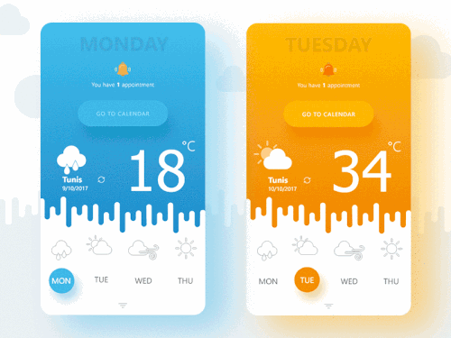

Looking at this design, there are images which I need to re-draw: the weather conditions (windy, sunny, etc), the bell, the zigzag looking like stalactite.

怎么样，是不是很像一款成熟的产品？仔细看一下这个实际，我们需要绘制的图片有：天气条件图标（有风，晴等等），上面的一个小铃铛以及看起来像钟乳石的小锯齿。 

First I will redraw everything using adobe illustator, this way I can have vectorized and high quality images. Next, I just need to slice the parts that I need.

首先我们需要使用adobe illustator来绘制这些图片, 通过它我们可以得到高质量的矢量图。接下来我们只需要截出我们需要的图片就可以了。

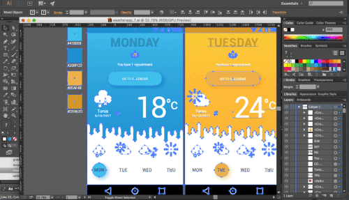

For the initial design, I only need the following 5 slices.

对于最初的界面设计来说，我们只需要以下的5张图片

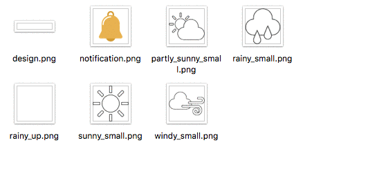

It is now time to create a new android project with an empty Activity.

现在是时候来创建一个包含空activity组件的安卓项目了：

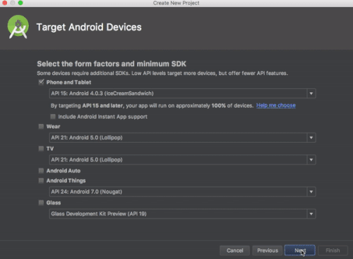

My newly created project looks like this.

我们新创建的项目就像这样。 

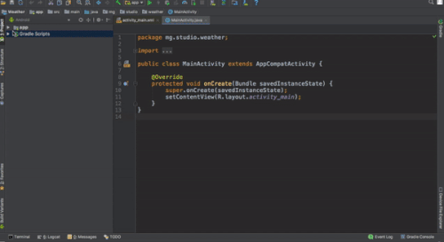

To check whether everything is working properly, I always run my application for testing as soon as I am done creating a new project. After major changes during my design and development process, I also proceed to a frequent testing by running the application.

为了保证是否所有一切都在正常工作，我们创建一个新项目后应该立即执行一下以来确认，在设计和开发的过程中，一旦对应用进行了较大的修改也应该运行立即应用来测试，这是一个很好也很重要的习惯。

My AVD specication is: 

我使用的虚拟设备规格如下: 

- Device name (设备名): Galaxy Nexus API 23
- Height (高度): 1280
- Width (宽度): 720
- API level (API等级): 23


I will do most of the design work in the 'activity_main.xml' which is located inside the 'res/layout' folder. Currently, below is what I have.

我们的设计工作将会主要在'activity_main.xml'文件中完整，该文件位于res/layout'文件夹。就当前的进度而言，这个文件中的内容应该如下所示：


```xml
<?xml version="1.0" encoding="utf-8"?>
<android.support.constraint.ConstraintLayout xmlns:android="http://schemas.android.com/apk/res/android"
    xmlns:app="http://schemas.android.com/apk/res-auto"
    xmlns:tools="http://schemas.android.com/tools"
    android:layout_width="match_parent"
    android:layout_height="match_parent"
    tools:context="mg.studio.weather.MainActivity">

    <TextView
        android:layout_width="wrap_content"
        android:layout_height="wrap_content"
        android:text="Hello World!"
        app:layout_constraintBottom_toBottomOf="parent"
        app:layout_constraintLeft_toLeftOf="parent"
        app:layout_constraintRight_toRightOf="parent"
        app:layout_constraintTop_toTopOf="parent" />

</android.support.constraint.ConstraintLayout>

```

For this project, I will choose to use a combination of [LinearLayout](https://developer.android.com/guide/topics/ui/layout/linear.html) and [RelativeLayout](https://developer.android.com/guide/topics/ui/layout/relative.html) instead of this [ConstraintLayout](https://developer.android.com/training/constraint-layout/index.html) which was auto-generated. I will change it as follow.

在这个应用中我们将会混合使用[LinearLayout（线性布局）](https://developer.android.com/guide/topics/ui/layout/linear.html)和[RelativeLayout（相对布局）](https://developer.android.com/guide/topics/ui/layout/relative.html)而不用自动生成的[ConstraintLayout（约束布局）](https://developer.android.com/training/constraint-layout/index.html)。我们进行如下的修改：

```xml
<?xml version="1.0" encoding="utf-8"?>
<LinearLayout xmlns:android="http://schemas.android.com/apk/res/android"
    xmlns:app="http://schemas.android.com/apk/res-auto"
    xmlns:tools="http://schemas.android.com/tools"
    android:layout_width="match_parent"
    android:layout_height="match_parent"
    android:orientation="vertical"
    tools:context="mg.studio.weather.MainActivity">

    <TextView
        android:layout_width="wrap_content"
        android:layout_height="wrap_content"
        android:text="Hello World!"
        app:layout_constraintBottom_toBottomOf="parent"
        app:layout_constraintLeft_toLeftOf="parent"
        app:layout_constraintRight_toRightOf="parent"
        app:layout_constraintTop_toTopOf="parent" />

</LinearLayout>

```

I still have the auto-generated 'TextView' inside my 'LinearLayout'. I will remove that to start clean. Notice the 'android:orientation="vertical"' which specifies the orientation of my 'LinearLayout'

现在仍然有自动生成的'TextView' 在我们的'LinearLayout'中。移除它以来确保对自动生成的布局清楚干净。注意 'android:orientation="vertical"'制定了'LinearLayout'的方向。


```xml
<?xml version="1.0" encoding="utf-8"?>
<LinearLayout xmlns:android="http://schemas.android.com/apk/res/android"
    xmlns:app="http://schemas.android.com/apk/res-auto"
    xmlns:tools="http://schemas.android.com/tools"
    android:layout_width="match_parent"
    android:layout_height="match_parent"
    android:orientation="vertical"
    tools:context="mg.studio.weather.MainActivity">

</LinearLayout>

```

I will now start modifying the Layout to reflect the required design. 

现在我们来修改xml代码以展现出我们设想的界面设计效果。

```xml
<?xml version="1.0" encoding="utf-8"?>
<LinearLayout xmlns:android="http://schemas.android.com/apk/res/android"
    xmlns:app="http://schemas.android.com/apk/res-auto"
    xmlns:tools="http://schemas.android.com/tools"
    android:layout_width="match_parent"
    android:layout_height="match_parent"
    android:background="#2495d1"
    android:orientation="vertical"
    android:weightSum="8"
    tools:context="mg.studio.weather.MainActivity">

    <TextView
        android:layout_width="match_parent"
        android:layout_height="0dp"
        android:layout_marginTop="10dp"
        android:layout_weight="1"
        android:gravity="center"
        android:text="Sunday"
        android:textAllCaps="true"
        android:textColor="#10000000"
        android:textSize="36sp"
        android:textStyle="bold" />

    <LinearLayout
        android:layout_width="match_parent"
        android:layout_height="0dp"
        android:layout_marginBottom="10dp"
        android:layout_weight="2"
        android:orientation="vertical">

        <ImageView
            android:id="@+id/imageView"
            android:layout_width="48dp"
            android:layout_height="48dp"
            android:layout_gravity="center"
            app:srcCompat="@mipmap/ic_launcher" />

        <TextView
            android:id="@+id/tv_news"
            android:layout_width="wrap_content"
            android:layout_height="wrap_content"
            android:layout_gravity="center"
            android:layout_margin="8dp"
            android:text="You have 1 appointment"
            android:textSize="10sp" />

        <Button
            android:id="@+id/button"
            android:layout_width="wrap_content"
            android:layout_height="wrap_content"
            android:layout_gravity="center"
            android:background="@drawable/ic_launcher_background"
            android:gravity="center"
            android:paddingLeft="40dp"
            android:paddingRight="40dp"
            android:text="Go to Calendar"
            android:textColor="#50ffffff" />
    </LinearLayout>

    <LinearLayout
        android:layout_width="match_parent"
        android:layout_height="0dp"
        android:layout_weight="3"
        android:orientation="vertical"
        android:weightSum="3">

        <RelativeLayout
            android:layout_width="match_parent"
            android:layout_height="0dp"
            android:layout_weight="2">

            <LinearLayout
                android:id="@+id/linearLayout"
                android:layout_width="wrap_content"
                android:layout_height="match_parent"
                android:layout_alignParentLeft="true"
                android:layout_margin="16dp"
                android:gravity="center_vertical"
                android:orientation="vertical">

                <ImageView
                    android:id="@+id/img_weather_condition"
                    android:layout_width="48dp"
                    android:layout_height="48dp"
                    android:layout_gravity="center"
                    app:srcCompat="@mipmap/ic_launcher" />

                <TextView
                    android:id="@+id/tv_location"
                    android:layout_width="wrap_content"
                    android:layout_height="wrap_content"
                    android:layout_gravity="center"
                    android:text="Location"
                    android:textColor="@android:color/white"
                    android:textStyle="bold" />

                <TextView
                    android:id="@+id/tv_date"
                    android:layout_width="wrap_content"
                    android:layout_height="wrap_content"
                    android:text="03/03/2018"
                    android:textColor="@android:color/white" />

            </LinearLayout>

            <LinearLayout
                android:id="@+id/tv_temperature"
                android:layout_width="wrap_content"
                android:layout_height="wrap_content"
                android:layout_alignParentEnd="true"
                android:layout_alignParentRight="true"
                android:layout_centerVertical="true"
                android:layout_marginEnd="30dp"
                android:layout_marginRight="30dp"
                android:orientation="horizontal">

                <TextView
                    android:layout_width="wrap_content"
                    android:layout_height="wrap_content"
                    android:text="18"
                    android:textColor="@android:color/white"
                    android:textSize="100sp"
                    android:textStyle="bold" />

                <TextView
                    android:layout_width="wrap_content"
                    android:layout_height="wrap_content"
                    android:layout_gravity="right"
                    android:text="°C"
                    android:textColor="@android:color/white"
                    android:textSize="22sp" />
            </LinearLayout>


        </RelativeLayout>

        <LinearLayout
            android:layout_width="match_parent"
            android:layout_height="0dp"
            android:layout_weight="1">

            <ImageView
                android:layout_width="match_parent"
                android:layout_height="match_parent"
                android:scaleType="fitXY"
                app:srcCompat="@mipmap/ic_launcher" />
        </LinearLayout>
    </LinearLayout>


    <LinearLayout
        android:layout_width="match_parent"
        android:layout_height="0dp"
        android:layout_weight="2"
        android:background="@android:color/white"
        android:orientation="horizontal"
        android:weightSum="4"
        tools:layout_editor_absoluteX="8dp"
        tools:layout_editor_absoluteY="380dp">

        <LinearLayout
            android:layout_width="0dp"
            android:layout_height="wrap_content"
            android:layout_weight="1"
            android:gravity="center"
            android:orientation="vertical">

            <ImageView
                android:layout_width="48dp"
                android:layout_height="48dp"
                app:srcCompat="@mipmap/ic_launcher" />

            <TextView
                android:layout_width="match_parent"
                android:layout_height="wrap_content"
                android:gravity="center"
                android:text="mon"
                android:textAllCaps="true"
                android:textColor="#909090" />
        </LinearLayout>

        <LinearLayout
            android:layout_width="0dp"
            android:layout_height="wrap_content"
            android:layout_weight="1"
            android:gravity="center"
            android:orientation="vertical">

            <ImageView
                android:layout_width="48dp"
                android:layout_height="48dp"
                app:srcCompat="@mipmap/ic_launcher" />

            <TextView
                android:layout_width="match_parent"
                android:layout_height="wrap_content"
                android:gravity="center"
                android:text="tue"
                android:textAllCaps="true"
                android:textColor="#909090" />
        </LinearLayout>

        <LinearLayout
            android:layout_width="0dp"
            android:layout_height="wrap_content"
            android:layout_weight="1"
            android:gravity="center"
            android:orientation="vertical">

            <ImageView
                android:layout_width="48dp"
                android:layout_height="48dp"
                app:srcCompat="@mipmap/ic_launcher" />

            <TextView
                android:layout_width="match_parent"
                android:layout_height="wrap_content"
                android:gravity="center"
                android:text="thu"
                android:textAllCaps="true"
                android:textColor="#909090" />
        </LinearLayout>

        <LinearLayout
            android:layout_width="0dp"
            android:layout_height="wrap_content"
            android:layout_weight="1"
            android:gravity="center"
            android:orientation="vertical">

            <ImageView
                android:layout_width="48dp"
                android:layout_height="48dp"
                app:srcCompat="@mipmap/ic_launcher" />

            <TextView
                android:layout_width="match_parent"
                android:layout_height="wrap_content"
                android:gravity="center"
                android:text="fri"
                android:textAllCaps="true"
                android:textColor="#909090" />
        </LinearLayout>
    </LinearLayout>
</LinearLayout>

```

Here is the current look of my layout

现在我们的布局看起来就像这样：

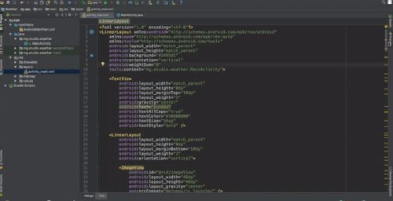

To see the fidelity of the design in my AVD, here is the output when I run the application.

为了确保在实际运行时与我们设计的界面效果一样，我在虚拟机中运行了一下，以下是输出结果：


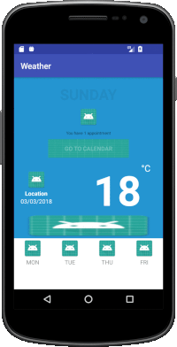


I will copy the images I created earlier and paste them into my drawable folder. If you are following me, there is something I would like to note here. By default, Android Studio displays your project files in the Android view. This view does not reflect the actual file hierarchy on disk but is organized by modules and file types to simplify navigation between key source files of your project, hiding certain files or directories that are not commonly used. ([Read more](https://developer.android.com/studio/projects/index.html))

我们要把之前创建的图片拷贝到drawable文件夹。如果大家现在都紧跟着我的进度，现在就要有一些事情需要注意。默认情况下, Android Studio将你的项目文件展示在安卓视图(Android view)中。而这个视图并不会展示出文件在硬盘上的真实结构，但是它是以模块的概念组织起来的并且通过文件类型来简化项目中关键资源文件之间的关系,它隐藏起来了真实文件结构和平常使用的目录. ([Read more](https://developer.android.com/studio/projects/index.html))

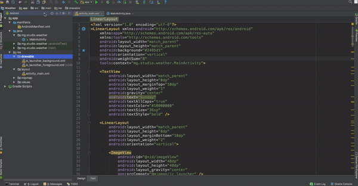


To make sure, my images are placed in the folder I want it to be, I will paste them into my drawable folder as shown below.

为了确保这些图片都放到了我们想要的放到的文件夹,将他们粘贴到drawable文件夹中，如下图所示。

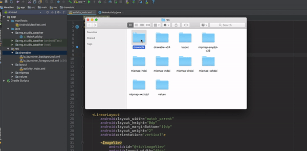

I can use those images now, but before, let me first get rid of the toolbar which is on top of my application.

现在我们可以使用这些图片了,但在这之前,让我们先删除应用顶部的工具栏（toolbar）.

Next, I will remove the action bar, as I want the application to use the full screen.

因为我们想要应用使用整个屏幕，所以我们要移除行动条（action bar）.  

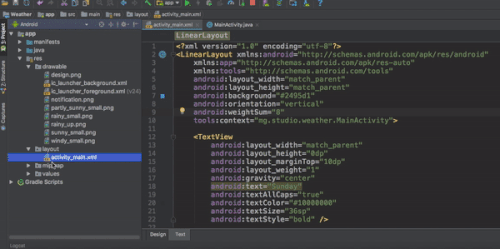

See the impact of that small change with the image below showing the before at the left and the after at the right.

来看一看这个对图片的小改动带来的影响，前后的效果如下图左右所示：

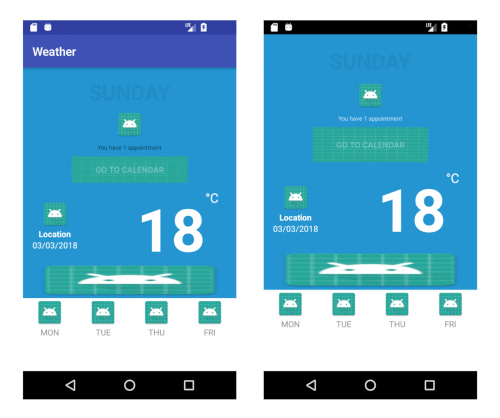

I will now continue with the images I added to my project. I will replace all the paths currently pointing to 'app:srcCompat="@mipmap/ic_launcher' and that display the green image in my application, and use the correct path for each image to be used. 
My images are inside the drawable folder, from the layout xml file, I can easily access them at 'app:srcCompat="@drawable/image_name_without_the_extension'

接下来我们继续处理添加到项目里的这些图片. 我们要把目前指向'app:srcCompat="@mipmap/ic_launcher'的路径全部替换,这个路径将会在我们的应用中展示绿色的安卓标志,我们用要使用的图片的正确路径来替换. 
+我们的图片全部都在drawable文件夹, 通过layout xml文件我们可以非常简单的处理他们就像这样：'app:srcCompat="@drawable/image_name_without_the_extension'

The good thing is, Android Studio will help me get the correct names with the auto-complete function.

一个非常友好的事情是，android studio将会通过自动补全函数来帮我们快速得到图片正确的全称.

```xml
<?xml version="1.0" encoding="utf-8"?>
<LinearLayout xmlns:android="http://schemas.android.com/apk/res/android"
    xmlns:app="http://schemas.android.com/apk/res-auto"
    xmlns:tools="http://schemas.android.com/tools"
    android:layout_width="match_parent"
    android:layout_height="match_parent"
    android:background="#2495d1"
    android:orientation="vertical"
    android:weightSum="8"
    tools:context="mg.studio.weather.MainActivity">

    <TextView
        android:layout_width="match_parent"
        android:layout_height="0dp"
        android:layout_marginTop="10dp"
        android:layout_weight="1"
        android:gravity="center"
        android:text="Sunday"
        android:textAllCaps="true"
        android:textColor="#10000000"
        android:textSize="36sp"
        android:textStyle="bold" />

    <LinearLayout
        android:layout_width="match_parent"
        android:layout_height="0dp"
        android:layout_marginBottom="10dp"
        android:layout_weight="2"
        android:orientation="vertical">

        <ImageView
            android:id="@+id/imageView"
            android:layout_width="48dp"
            android:layout_height="48dp"
            android:layout_gravity="center"
            app:srcCompat="@drawable/notification" />

        <TextView
            android:id="@+id/tv_news"
            android:layout_width="wrap_content"
            android:layout_height="wrap_content"
            android:layout_gravity="center"
            android:layout_margin="8dp"
            android:text="You have 1 appointment"
            android:textSize="10sp" />

        <Button
            android:id="@+id/button"
            android:layout_width="wrap_content"
            android:layout_height="wrap_content"
            android:layout_gravity="center"
            android:background="@drawable/ic_launcher_background"
            android:gravity="center"
            android:paddingLeft="40dp"
            android:paddingRight="40dp"
            android:text="Go to Calendar"
            android:textColor="#50ffffff" />
    </LinearLayout>

    <LinearLayout
        android:layout_width="match_parent"
        android:layout_height="0dp"
        android:layout_weight="3"
        android:orientation="vertical"
        android:weightSum="3">

        <RelativeLayout
            android:layout_width="match_parent"
            android:layout_height="0dp"
            android:layout_weight="2">

            <LinearLayout
                android:id="@+id/linearLayout"
                android:layout_width="wrap_content"
                android:layout_height="match_parent"
                android:layout_alignParentLeft="true"
                android:layout_margin="16dp"
                android:gravity="center_vertical"
                android:orientation="vertical">

                <ImageView
                    android:id="@+id/img_weather_condition"
                    android:layout_width="48dp"
                    android:layout_height="48dp"
                    android:layout_gravity="center"
                    app:srcCompat="@drawable/rainy_up" />

                <TextView
                    android:id="@+id/tv_location"
                    android:layout_width="wrap_content"
                    android:layout_height="wrap_content"
                    android:layout_gravity="center"
                    android:text="Location"
                    android:textColor="@android:color/white"
                    android:textStyle="bold" />

                <TextView
                    android:id="@+id/tv_date"
                    android:layout_width="wrap_content"
                    android:layout_height="wrap_content"
                    android:text="03/03/2018"
                    android:textColor="@android:color/white" />

            </LinearLayout>

            <LinearLayout
                android:id="@+id/tv_temperature"
                android:layout_width="wrap_content"
                android:layout_height="wrap_content"
                android:layout_alignParentEnd="true"
                android:layout_alignParentRight="true"
                android:layout_centerVertical="true"
                android:layout_marginEnd="30dp"
                android:layout_marginRight="30dp"
                android:orientation="horizontal">

                <TextView
                    android:layout_width="wrap_content"
                    android:layout_height="wrap_content"
                    android:text="18"
                    android:textColor="@android:color/white"
                    android:textSize="100sp"
                    android:textStyle="bold" />

                <TextView
                    android:layout_width="wrap_content"
                    android:layout_height="wrap_content"
                    android:layout_gravity="right"
                    android:text="°C"
                    android:textColor="@android:color/white"
                    android:textSize="22sp" />
            </LinearLayout>


        </RelativeLayout>

        <LinearLayout
            android:layout_width="match_parent"
            android:layout_height="0dp"
            android:layout_weight="1">

            <ImageView
                android:layout_width="match_parent"
                android:layout_height="match_parent"
                android:scaleType="fitXY"
                app:srcCompat="@drawable/design" />
        </LinearLayout>
    </LinearLayout>


    <LinearLayout
        android:layout_width="match_parent"
        android:layout_height="0dp"
        android:layout_weight="2"
        android:background="@android:color/white"
        android:orientation="horizontal"
        android:weightSum="4"
        tools:layout_editor_absoluteX="8dp"
        tools:layout_editor_absoluteY="380dp">

        <LinearLayout
            android:layout_width="0dp"
            android:layout_height="wrap_content"
            android:layout_weight="1"
            android:gravity="center"
            android:orientation="vertical">

            <ImageView
                android:layout_width="48dp"
                android:layout_height="48dp"
                app:srcCompat="@drawable/rainy_small" />

            <TextView
                android:layout_width="match_parent"
                android:layout_height="wrap_content"
                android:gravity="center"
                android:text="mon"
                android:textAllCaps="true"
                android:textColor="#909090" />
        </LinearLayout>

        <LinearLayout
            android:layout_width="0dp"
            android:layout_height="wrap_content"
            android:layout_weight="1"
            android:gravity="center"
            android:orientation="vertical">

            <ImageView
                android:layout_width="48dp"
                android:layout_height="48dp"
                app:srcCompat="@drawable/partly_sunny_small" />

            <TextView
                android:layout_width="match_parent"
                android:layout_height="wrap_content"
                android:gravity="center"
                android:text="tue"
                android:textAllCaps="true"
                android:textColor="#909090" />
        </LinearLayout>

        <LinearLayout
            android:layout_width="0dp"
            android:layout_height="wrap_content"
            android:layout_weight="1"
            android:gravity="center"
            android:orientation="vertical">

            <ImageView
                android:layout_width="48dp"
                android:layout_height="48dp"
                app:srcCompat="@drawable/windy_small" />

            <TextView
                android:layout_width="match_parent"
                android:layout_height="wrap_content"
                android:gravity="center"
                android:text="thu"
                android:textAllCaps="true"
                android:textColor="#909090" />
        </LinearLayout>

        <LinearLayout
            android:layout_width="0dp"
            android:layout_height="wrap_content"
            android:layout_weight="1"
            android:gravity="center"
            android:orientation="vertical">

            <ImageView
                android:layout_width="48dp"
                android:layout_height="48dp"
                app:srcCompat="@drawable/sunny_small" />

            <TextView
                android:layout_width="match_parent"
                android:layout_height="wrap_content"
                android:gravity="center"
                android:text="fri"
                android:textAllCaps="true"
                android:textColor="#909090" />
        </LinearLayout>
    </LinearLayout>
</LinearLayout>


```

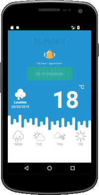

So far so good, but I still need to update my button. I could use an image for this button as well, but I know I can achieve this desired design by using shapes.

到目前为止我们的工作完成的很好，接下来将要更新按钮。按钮也可以使用一个图片来展示就像之前我们做的那样，不过我们可以通过IDE本身提供的形状（shapes）来达到我们想要的设计。

In Android, we can intercept the states of a given button: normal position or pressed. I can then specify the design to be used for each given state.

在安卓中我们可以把一个按钮的状态分为两类：普通状态，被点击状态. 我们可以为每个状态指定一种设计.

I will create 3 new files and will place them in my drawable folder. A selector and two other files for shape definitions.

我们将要在drawable文件夹中创建三个新文件. 一个选择器以及两个其他的文件来为按钮定义形状.

- button_selector.xml
- button_shape.xml
- button_shape_pressed.xml

Here is the content of my button_selector file:

下面展示了我的button_selector文件：

```xml
<?xml version="1.0" encoding="utf-8"?>
<selector xmlns:android="http://schemas.android.com/apk/res/android">
    <!--When the button is pressed-->
    <item android:drawable="@drawable/button_shape_pressed" android:state_pressed="true" />
    <!--Default-->
    <item android:drawable="@drawable/button_shape" />
</selector>

```

For the shape definitions:

下面定义了按钮的形状:
button_shape:

```xml
<?xml version="1.0" encoding="utf-8"?>
<shape xmlns:android="http://schemas.android.com/apk/res/android"
    android:shape="rectangle">
    <solid android:color="#31a7dc" />
    <corners android:radius="90dp" />
</shape>
```

button_shape_pressed:

当按钮被点击时:

```xml
<?xml version="1.0" encoding="utf-8"?>
<shape xmlns:android="http://schemas.android.com/apk/res/android"
    android:shape="rectangle">
    <solid android:color="#2191ce" />
    <corners android:radius="90dp" />
</shape>
```

Next, I just need to use the selector (button_selector.xml) as the background of my button.

接下来只需要使用选择器(button_selector.xml) 来作为我们按钮的背景即可.

Before: 
之前:

```xml
    android:background="@drawable/ic_launcher_background"

```

After:
之后:

```xml
    android:background="@drawable/button_selector"

```

See the output difference now:

来看看在输出上的不同:

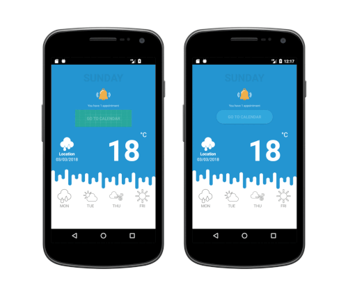

The design is almost there, but there is something I would like to fix. Notice that I always design having in mind that the user will use the application in portrait mode. If I rotate the AVD while the application is running, see the result:

到此界面设计基本就要完成了，但仍有一些事情需要设置. 我们在设计时总是下意识的认为用户会在竖屏模式下使用我们的应用.如果我们在应用运行时将虚拟机旋转一下，来看看结果:

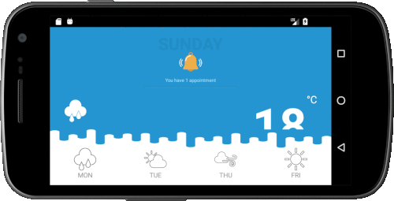

I can fix this temporarily by setting the layout screen orientation of the activity to be in portrait mode despite any phone rotation. For that, I can update that my android manifest file.

我们可以通过将这个activity组件的屏幕布局方向设置为无论手机如何旋转都处于竖屏模式来暂时解决这个问题。为此需要更新我们的android manifest文件.

```xml
<?xml version="1.0" encoding="utf-8"?>
<manifest xmlns:android="http://schemas.android.com/apk/res/android"
    package="mg.studio.weather">

    <application
        android:allowBackup="true"
        android:icon="@mipmap/ic_launcher"
        android:label="@string/app_name"
        android:roundIcon="@mipmap/ic_launcher_round"
        android:supportsRtl="true"
        android:theme="@style/Theme.AppCompat.NoActionBar">
        <activity android:name=".MainActivity"
            android:screenOrientation="portrait">
            <intent-filter>
                <action android:name="android.intent.action.MAIN" />

                <category android:name="android.intent.category.LAUNCHER" />
            </intent-filter>
        </activity>
    </application>

</manifest>
```
So now, even if the phone is rotated in landscape mode, the activity of the application won't rotate and the design won't break.

所以现在即便手机旋转到了横屏模式，此应用的此活动组件页面也不会旋转，我们所作的界面设计也不会因此而变得乱七八糟。

# Connecting the application to the Internet and updating the content based on the weather forecast
# 后端：将应用连上网络并依据天气预报信息对内容进行更新

To connect the application to the Internet, there are few things I should already know:
为了使应用可以连接上互联网，有一些事情是我们必须提前知道的：

1. How to listen to a button click?  This is a fundamental question that is still very trivial. I already have a post on [how to display a toast when a button is clicked](https://github.com/dragona/Android_intro/tree/master/03_Button_Toast)

如何来监听一个按钮?  这是一个非常基础但也十分简单的问题。我已经发布了[how to display a toast when a button is clicked](https://github.com/dragona/Android_intro/tree/master/03_Button_Toast)

2. Permission: To protect the privacy of the device owner, Android has some set of permissions in place. Because of that, sometimes, the applications we create need to request permission to access certain features such as the Internet. If you have time, [read more](https://developer.android.com/guide/topics/permissions/overview.html) about the Android permission. For this weather application, I just need to add the explicit permission request inside my AndroidManifest file that the application needs to access the Internet.

权限许可: 为了保护设备所有者的隐私, 安卓设置了一些权限许可。正因为如此，某些时候我们所创建的应用需要获得用户的一些许可，比如能够连接网络的权限许可。如果你有时间的话关于安卓权限问题可以参考, [read more](https://developer.android.com/guide/topics/permissions/overview.html) .对于这个天气应用来说, 我们只需要简单明了的把应用需要连接网络的权限请求放在AndroidManifest文件即可。

```xml
    <uses-permission android:name="android.permission.INTERNET"/>

```

3. AsyncTask: This is a class added to the API level 3 that enables proper and easy use of the UI thread. In this weather applicaiton, I need to get some data from the Internet, this is an action that should not last more than few seconds (with a decent Internet access). I will use an [asynchronous task](https://developer.android.com/reference/android/os/AsyncTask.html) to process the download of the data in the background and to avoid a UI freezing.

AsyncTask（异步任务）: 这是一个添加在API level 3中的类，它可以帮助我们正确并简单的使用界面线程（UI thread）.在这个天气应用中, 我们需要从互联网上获取一些数据, 这是一个正常情况下几秒之内就完成的行为 (在一个好的网络环境中). 我们需要使用 [asynchronous task](https://developer.android.com/reference/android/os/AsyncTask.html) 来在界面背后处理下载来的数据并且避免界面停顿的情况.

4. ConnectivityManager: I don`t need to query of an online data when my device does not have access to the Internet. That is a characteristic that the weather application should detect by itself. The [ConnectivityManager](https://developer.android.com/reference/android/net/ConnectivityManager.html) class was added to Android since the API 1 and I can use it to monitor network connections.

ConnectivityManager（连接管理）: 当我们的设备没有联网时我们就不需要去网上获取数据. 这一行为应该由我们的天气应用自己来监控.[ConnectivityManager](https://developer.android.com/reference/android/net/ConnectivityManager.html) 这个类早在API 1时代就被添加进来了，我们可以利用它来监测网络连接情况.


Now that I have an understanding of the 4 points above, here is my plan on how I am going to finish this application: add a listener to the Button so that when I press it, I can initiate the download of the latest weather forecast that will later be displayed on the application.

现在我们知道了以上的四点, 我们完成这个天气应用的计划也变成了这样: 对按钮添加一个监听，当我们按它时, 就可以依据所下载的最新天气预报来产生即将展示在应用界面上的天气信息。


I designed the button from my xml file, in other words, I can set the onClick listener from there as well.

我们之前在xml文件中完成的对按钮的设计,不言而喻, 我们也可以在同样的文件中对它设置监听.

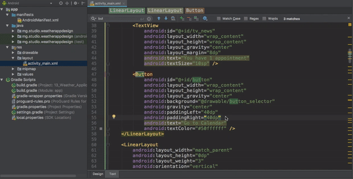

Now, the description of my button in my xml file looks like this:

现在在xml文件中对于该按钮的描述变成了这样:

```xml
 <Button
            android:id="@+id/button"
            android:layout_width="wrap_content"
            android:layout_height="wrap_content"
            android:layout_gravity="center"
            android:background="@drawable/button_selector"
            android:gravity="center"
            android:paddingLeft="40dp"
            android:paddingRight="40dp"
            android:onClick="btnClick"
            android:text="Go to Calendar"
            android:textColor="#50ffffff" />

```

My MainActivity.java file has finally been updated. 

我们的MainActivity.java文件也终于被更新了： 

```java
import android.support.v7.app.AppCompatActivity;
import android.os.Bundle;
import android.view.View;

public class MainActivity extends AppCompatActivity {

    @Override
    protected void onCreate(Bundle savedInstanceState) {
        super.onCreate(savedInstanceState);
        setContentView(R.layout.activity_main);
    }

    public void btnClick(View view) {
        //to do when the button is clicked

    }
}

```

Following with my initial plan, when I click on the button, the app will download the data from the Internet and the latest value of the temperature should be displayed. First, I will implement the button click that will change the temperature`s default value set from the XML.

按照我们最初的设想, 当按钮被点击时,这个应用将会从互联网上下载数据，并且将最新的温度值展示出来.首先我们要使用按钮来改变在xml中设置的温度初始值.

Here are what I need to do:

这里是我们需要做的事情:

- specify a name for the TextView that displays the temperature and which needs to be updated dynamically when I click on the button. This name later will be used for identifying the TextView.

为这个当按钮被点击时，展示温度并且需要动态更新的TextView指定一个名字.所起的名字稍后将会用来辨认这个TextView.

- add the code to change the content of the TextView when the button is pressed

添加代码以在按钮被点击时更新TextView的内容

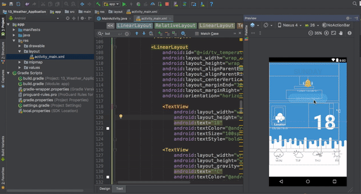

```xml

    <TextView
        android:id="@+id/temperature_of_the_day"
        android:layout_width="wrap_content"
        android:layout_height="wrap_content"
        android:text="18"
        android:textColor="@android:color/white"
        android:textSize="100sp"
        android:textStyle="bold" />

```

```java
public void btnClick(View view) {
        ((TextView)findViewById(R.id.temperature_of_the_day)).setText("27");
    }
```


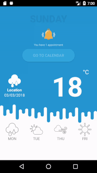

Now that button is working, I need to add the permission in my manifest file in order to access the internet and next, I need to implement the asynctask for downloading the lastest weather forecast from the server.

现在按钮可以按预想工作了, 我们需要在manifest文件中添加权限申请以来访问互联网, 以及使用异步任务（asynctask）来从服务器上下载最新的天气预报信息.

As I already mentioned above, the following is the code I need to add into my manifest file for the explicit permission request for the Internet.

正如之前已经提到的那样,下面的代码需要添加到manifest文件中以来进行访问互联网权限许可的请求.

```xml
<uses-permission android:name="android.permission.INTERNET"/>
```

I will use the following class in my MainActivity.java file for getting the latest weatherforcast from the server.

我们需要在MainActivity.java文件中使用下面这个类以来从服务器获得最新的天气预报信息.

```java

    private class DownloadUpdate extends AsyncTask<String, Void, String> {


        @Override
        protected String doInBackground(String... strings) {
            String stringUrl = "http://mpianatra.com/Courses/info.txt";
            HttpURLConnection urlConnection = null;
            BufferedReader reader;

            try {
                URL url = new URL(stringUrl);

                // Create the request to get the information from the server, and open the connection
                urlConnection = (HttpURLConnection) url.openConnection();

                urlConnection.setRequestMethod("GET");
                urlConnection.connect();

                // Read the input stream into a String
                InputStream inputStream = urlConnection.getInputStream();
                StringBuffer buffer = new StringBuffer();
                if (inputStream == null) {
                    // Nothing to do.
                    return null;
                }
                reader = new BufferedReader(new InputStreamReader(inputStream));

                String line;
                while ((line = reader.readLine()) != null) {
                    // Mainly needed for debugging
                    buffer.append(line + "\n");
                }

                if (buffer.length() == 0) {
                    // Stream was empty.  No point in parsing.
                    return null;
                }
                //The temperature
                return buffer.toString();

            } catch (MalformedURLException e) {
                e.printStackTrace();
            } catch (ProtocolException e) {
                e.printStackTrace();
            } catch (IOException e) {
                e.printStackTrace();
            }

            return null;
        }

        @Override
        protected void onPostExecute(String temperature) {
            //Update the temperature displayed 
            ((TextView) findViewById(R.id.temperature_of_the_day)).setText(temperature);
        }
    }
```

It is important to note here that the information retrieved from the server based on the testing link above is just the string 27. Further parsing might be required if the return from the server was of a different format.

应该注意到，在上述的测试连接中从服务器取回的信息只是一个字符串（string）27。 如若服务器返回了不同格式的信息则可能需要我们进行更进一步的字符解析.

So far, I can download the latest weather temperature from the server as long as I have Internet access. What will happen if the device does not have access to the Internet?

到目前为止,只要有互联网连接我们就可以从服务器下载最新的天气温度信息.那么当没有网络连接时我们的应用会怎么样呢?
