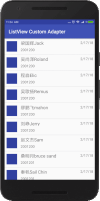

# ListView




A list view is a view group that holds one or multiple views in one item and which can be composed of multiple item elements.
 To create a populated list view, here are what I need:

- Create a specific design for the item list
- Design the layout (connect to the Java file) that holds the list view
- Prepare the data for populating the listView, most of the time it is in the form of an array.
- Create an array adapter to place the array in the listView
- The last step is to connect the listView and the Java class and to populate the list View using the ArrayAdapter
- Optionally, we can listen to the clicks on each item of the listView by adding  the onclick item listener to the listView item. 


## Reference
```
https://developer.android.com/guide/topics/ui/layout/listview.html
```