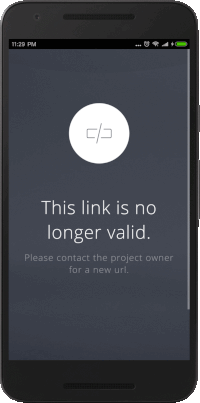

# Webview




```java

@Override
    protected void onCreate(Bundle savedInstanceState) {
        super.onCreate(savedInstanceState);
        setContentView(R.layout.activity_main);

        progressDialog = ProgressDialog.show(this, "Loading","Please wait...", true);
        progressDialog.setCancelable(false);

        webView = findViewById(R.id.web_view);

        webView.getSettings().setJavaScriptEnabled(true);
        webView.getSettings().setLoadWithOverviewMode(true);
        webView.getSettings().setUseWideViewPort(true);
        webView.setWebViewClient(new WebViewClient(){

            @Override
            public boolean shouldOverrideUrlLoading(WebView view, String url) {
                progressDialog.show();
                view.loadUrl(url);

                return true;
            }
            @Override
            public void onPageFinished(WebView view, final String url) {
                progressDialog.dismiss();
            }
        });
        webView.getSettings().setDomStorageEnabled(true);
        
        webView.loadUrl("https://example.com");

    }

```


```java
private void hideSystemUI() {
        // Set the IMMERSIVE flag.
        // Set the content to appear under the system bars so that the content
        // doesn't resize when the system bars hide and show.
        if (Build.VERSION.SDK_INT >= Build.VERSION_CODES.KITKAT) {
            getWindow().getDecorView().setSystemUiVisibility(
                    View.SYSTEM_UI_FLAG_LAYOUT_STABLE
                            | View.SYSTEM_UI_FLAG_LAYOUT_HIDE_NAVIGATION
                            | View.SYSTEM_UI_FLAG_LAYOUT_FULLSCREEN
                            | View.SYSTEM_UI_FLAG_HIDE_NAVIGATION // Hide nav bar
                            | View.SYSTEM_UI_FLAG_FULLSCREEN // Hide status bar
                            | View.SYSTEM_UI_FLAG_IMMERSIVE);
        }
    }
```