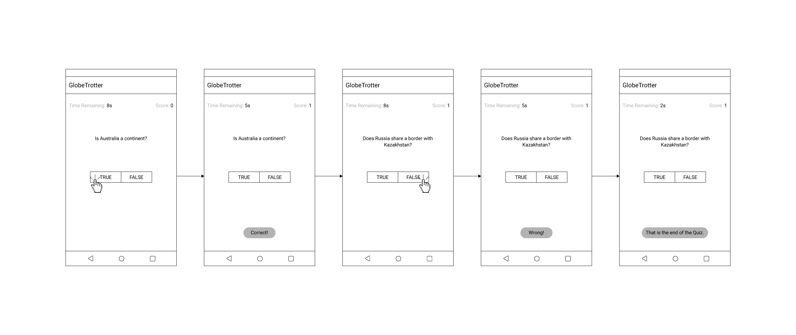
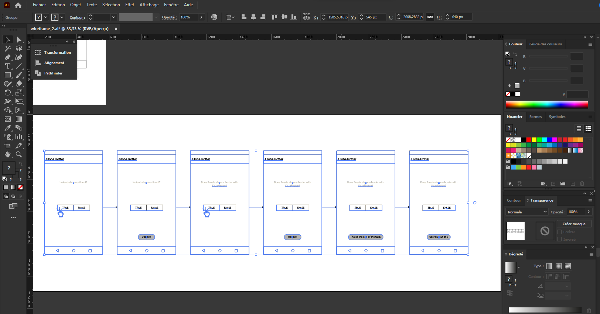
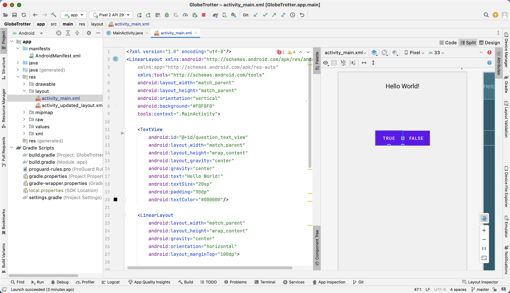
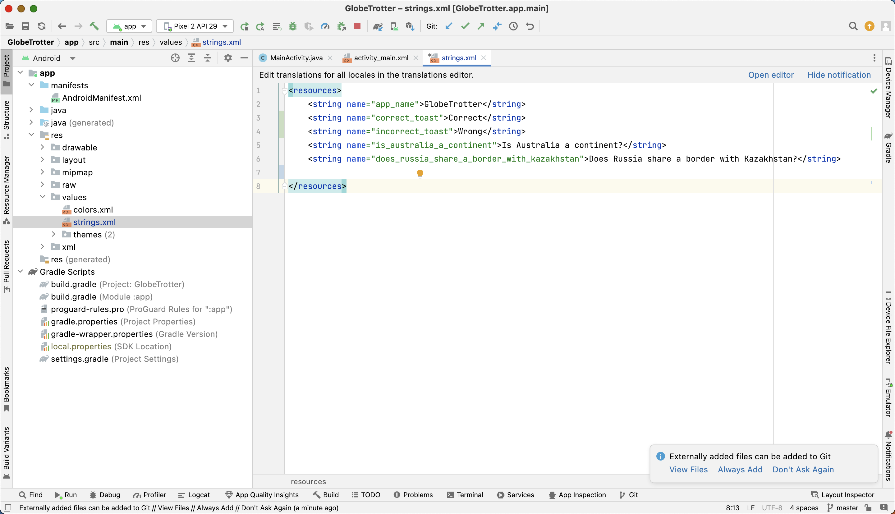
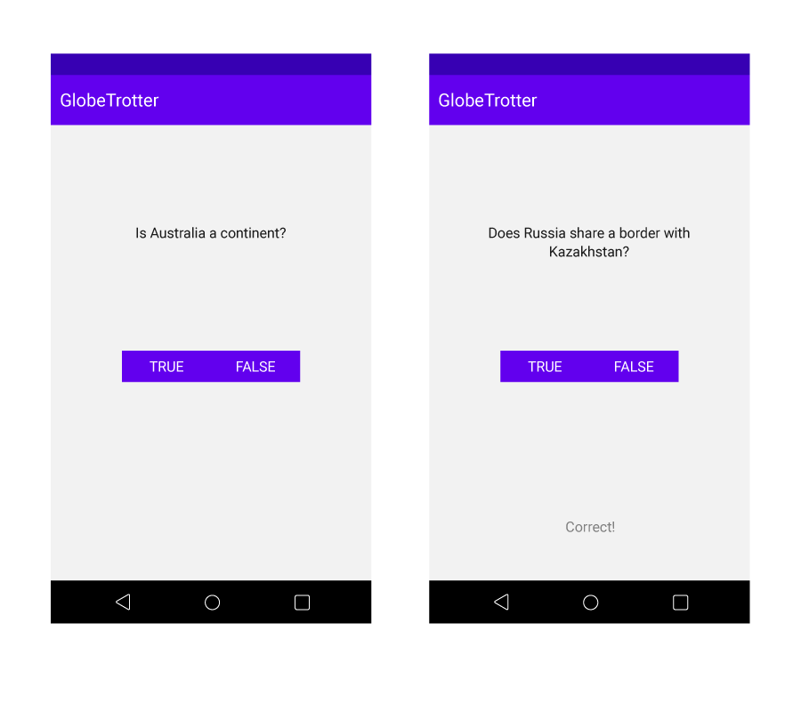

# Prerequisites

To effectively use this book, you should have a strong understanding of object-oriented programming concepts, specifically in Java. However, having a solid grasp of Kotlin, including classes and objects, interfaces, listeners, packages, inner classes, object expressions, and generic classes, is preferred.

If these topics are not familiar to you, it is recommended to start with an introductory Kotlin book before proceeding with this book. This will ensure a smoother understanding of the content as you progress. It is also recommended to have a Kotlin reference on hand for additional support as you read through the book.

<details>
<summary>Click here to see read more</summary>

## Kotlin or Java?

In 2017, Google officially announced support for Kotlin in Android development, after a rising number of developers had already been utilizing it unofficially. Today, Kotlin is the favored language for most Android developers, although Java is still used. For this course, Java will be used while introducing the use of Kotlin from time to time. However, it's always an advantage to have knowledge of Kotlin if one plans to be a serious Android application developer, particularly due to its unique features like Jetpack Compose that are only available with Kotlin. Despite the original Java implementation of the Android framework and many Android classes, Kotlin's interoperability with Java ensures a smooth transition for developers. As the Android platform evolves, Kotlin is becoming increasingly vital to its future, and both Google and the Android developer community are investing in making Kotlin development easier and more valuable for Android. Join this growing community and reap the benefits of Kotlin in Android development.

For those curious to know more about Kotlin, you can visit:
- Kotlin official website: https://kotlinlang.org/
- Kotlin documentation: https://kotlinlang.org/docs/reference/
- Kotlin on Android (Google's official page): https://developer.android.com/kotlin/first

## Getting Started: Required Tools

This book requires the use of Android Studio for its examples and exercises. Android Studio is an integrated development environment designed for Android development and built on the IntelliJ IDEA platform.

When you install Android Studio, you will have access to the following tools:
- The latest version of the Android SDK
- Android SDK tools and platform tools for debugging and testing your apps
- A system image for the Android emulator to test your apps on different virtual devices

Please note that Android Studio is continuously evolving, so there may be differences between your version and what is displayed in this book.

## Installing Android Studio

To start developing Android apps, you will need to download and install Android Studio. You can find it on the Android Developer website at [developer.android.com/studio](developer.android.com/studio). This software provides all the necessary tools and resources to build and run Android applications. It comes with a built-in Java Development Kit, making it easier to get started.

It is important to note that the latest version of the Android Gradle plugin, which is used for building and compiling Android apps, requires Java 11. However, newer versions of the Java Development Kit should also work. For any additional information or help, you can refer back to the Android Developer website at [developer.android.com/studio](developer.android.com/studio).

To install Android Studio in China, users can follow these steps:
1. Download the Android Studio installation package from a reliable source, such as a mirror site or a local software repository.
2. Install Android Studio following the on-screen instructions.
3. If you encounter any issues during the installation process, consult the Android Studio documentation or reach out to the Android Studio community for support.

Note: It's important to make sure that the source of the Android Studio installation package is trustworthy and free of malware or other security threats.

## Android Emulator

The Android emulator is a virtual device that runs on your computer, allowing you to test and debug your Android applications without the need for a physical device. With the Android emulator, you will have the ability to test your applications in various scenarios and configurations, making the development process easier and more efficient.
In order to work withthe Android Emulator, you will need to download and install the necessary tools, including Android Studio and the Android SDK. Once these tools are installed, you can then create and run virtual devices, which allow you to simulate different scenarios and configurations.

## Using a Physical Android Device

While the emulator is useful for testing purposes, it cannot accurately measure the performance of your app like a physical Android device can. For the best experience, it is recommended to use a physical Android device during certain parts of this book. The benefits and utilization of physical devices will be discussed further in the book.

</details>

# Your First Android Application

Welcome to the world of Android Development! This first chapter is a great starting point for learning the new concepts and moving parts involved in building an Android application. Do not worry if you do not fully understand everything by the end of this chapter, as we will be revisiting these ideas in greater detail as we progress through the book.

Imagine you're a student studying geography, and you want a fun and interactive way to learn about the world's countries and cities. You want to test your knowledge and challenge yourself with questions that cover different topics, such as which countries share borders, what the capital cities are, and which continent a country is located in.

You also want to track your progress and see how much you've improved over time. You want to be able to compete with your friends and family and compare scores to see who knows more about the world.

That's where the Globetrotter app comes in. It's a fun and educational game that allows you to test your geography knowledge in a challenging and interactive way. With its user-friendly interface, you can easily navigate through the different questions and track your progress with each round.

So, whether you're a student looking to improve your geography skills or simply someone who loves to explore the world, the Globetrotter app is the perfect tool for you!


We will start by creating an Android app called GlobeTrotter Quiz, which will prompt the user to press either TRUE or FALSE to answer a question displayed on the screen. The app will then provide instant feedback. To begin, we need a set of questions to use.


| Question | Answer |
| --- | --- |
| Is Australia a continent? | Yes |
| Does Russia share a border with Kazakhstan? | Yes |
| Is the Equator located in the Northern Hemisphere? | No |
| Is the highest mountain in the world located in the Himalayas? | Yes |
| Does the Amazon River flow through Brazil? | Yes |
| Is the Red Sea located between Africa and Asia? | Yes |
| Is the capital of France Paris? | Yes |
| Does the River Nile flow into the Mediterranean Sea? | Yes |
| Is the Great Barrier Reef located off the coast of Australia? | Yes |
| Is the Arctic Ocean located in the Southern Hemisphere? | No |
| Is the Dead Sea located between Jordan and Israel? | Yes |
| Does the Amazon Rainforest span over multiple countries? | Yes |
| Is Mount Everest the highest mountain in the world? | Yes |
| Is the Sahara Desert located in North Africa? | Yes |
| Is the largest ocean in the world the Pacific Ocean? | Yes |


## The logic

the this first version of the GlobeTrotter Quiz app shall be like this 

```
START

Initialize score to 0

WHILE there are still questions in the question bank
  Display the current question
  Get the answer from the user
  IF the answer is correct
    Increment the score by 1
  END IF
END WHILE

Display the final score

END
```


## Outline of the code for the app

1. Set up the Android project in Android Studio and create a new activity for the quiz.
2. Create a layout for the quiz activity using XML. 
    - This layout should include:
        - A TextView for displaying questions
        - Two buttons for answering the questions (True and False)
        - A TextView for displaying feedback.
3. Create a Quiz class that will store the questions and answers for the quiz. 
    - This class should have:
        - A constructor that sets up the questions and answers
        - A method for getting the current question
        - A method for checking the answer
        - A method for getting the feedback for the answer.
4. In the quiz activity, create an instance of the Quiz class and use it to:
    - Display the current question
    - Check the answer when the user presses a button
    - Display the feedback.
5. Add logic to the quiz activity to keep track of the user's score and move to the next question when the user answers the current question.
6. Add a menu to the quiz activity that allows the user to:
    - Reset the quiz
    - View the answers (Optional).
7. Add styles and colors to the quiz activity to make it look nice.

## Wireframe



## The code

Let's start with the XML layout file that defines the user interface of the MainActivity in the GlobeTrotter app. The layout should be structured as a vertical LinearLayout that should contain a TextView and a nested horizontal LinearLayout containing two Buttons.

The first TextView, with id "question_text_view," takes up the full width of the screen and is centered both horizontally and vertically. It displays the question prompt for the current question, and is styled with a black text color on a light gray (#F0F0F0) background, and has a large 30dp padding.

The nested LinearLayout, which is centered vertically in the parent layout, contains two Buttons, the "true_button" and the "false_button." Each button has a blue background (#2196F3) and white text color, and their width is set to "wrap_content" to make them just large enough to fit their text.

Overall, this layout creates a simple and straightforward interface for the user to read and answer a geography question, by providing a large and clear question prompt and two clickable buttons to select either true or false.



<details>
<summary>Click here to see the Layout XML code</summary>

```xml
<?xml version="1.0" encoding="utf-8"?>
<LinearLayout xmlns:android="http://schemas.android.com/apk/res/android"
    xmlns:app="http://schemas.android.com/apk/res-auto"
    xmlns:tools="http://schemas.android.com/tools"
    android:layout_width="match_parent"
    android:layout_height="match_parent"
    android:orientation="vertical"
    android:background="#F0F0F0"
    tools:context=".MainActivity">

    <TextView
        android:id="@+id/question_text_view"
        android:layout_width="match_parent"
        android:layout_height="wrap_content"
        android:layout_gravity="center"
        android:gravity="center"
        android:text="Hello World!"
        android:textSize="20sp"
        android:padding="30dp"
        android:textColor="#000000"/>

    <LinearLayout
        android:layout_width="match_parent"
        android:layout_height="wrap_content"
        android:gravity="center"
        android:orientation="horizontal"
        android:layout_marginTop="100dp">

        <Button
            android:id="@+id/true_button"
            android:layout_width="wrap_content"
            android:layout_height="wrap_content"
            android:background="#2196F3"
            android:textColor="#FFFFFF"
            android:text="True" />

        <Button
            android:id="@+id/false_button"
            android:layout_width="wrap_content"
            android:layout_height="wrap_content"
            android:background="#2196F3"
            android:textColor="#FFFFFF"
            android:text="False" />
    </LinearLayout>

</LinearLayout>

```

</details>


Now, let's open our string resource XML file that defines a set of strings for the "GlobeTrotter"  app. These string resources are defined within the <resources> tag and given a name with the name attribute. The value of each string resource is defined between the opening and closing tags of each string resource element.



In this specific case, the string resources define the name of the app (app_name), and we will add several question prompts for the app (is_australia_a_continent, does_russia_share_a_border_with_kazakhstan, etc.).


```xml
<resources>
    <string name="app_name">GlobeTrotter</string>
    <string name="correct_toast">Correct</string>
    <string name="incorrect_toast">Wrong</string>
    <string name="is_australia_a_continent">Is Australia a continent?</string>
    <string name="does_russia_share_a_border_with_kazakhstan">Does Russia share a border with Kazakhstan?</string>

</resources>
```

Time to open the MainActivity.java code of our GlobeTrotter app. The code is responsible for creating the main activity of the application, which consists of a question displayed on a text view and two buttons to answer it.

The class extends the AppCompatActivity class, 

```java 
public class MainActivity extends AppCompatActivity {
   //...
}
```

which provides the base implementation for the activity. The class also declares private member variables, including the True and False buttons, a text view for the question, an array of Question objects, and an index to keep track of the current question.

The `onCreate()` method is called when the activity is created, 

```java 
@Override
    protected void onCreate(Bundle savedInstanceState) {
    //...
    }
```

and it initializes the member variables, sets up the click listeners for the True and False buttons, and calls the `updateQuestion()` method to display the first question.

The `setContentView(R.layout.activity_main);` connects this Java code to the XML layout file named `activity_main.xml`, which defines the layout for the main activity of the GlobeTrotter application.  The layout consists of a vertical LinearLayout that contains a text view to display the question and a horizontal LinearLayout that contains two buttons for True and False. The IDs for the text view and buttons are used in the Java code to reference the views and set up the click listeners.

The `updateQuestion()` method updates the question displayed on the text view to the current question in the Question array.

The `checkAnswer()` method checks the user's answer and displays a message if it is correct or incorrect. It also increments the current index to display the next question if there are more questions left, or displays a message indicating that the quiz is over if there are no more questions.

The Question class is a private inner class that is used to store each question and its answer as a Question object. The text of the question is stored as a string resource ID, and the answer is stored as a boolean value.


<details>
<summary>Click here to see the Java code</summary>

```java
package com.example.globetrotter;

import androidx.appcompat.app.AppCompatActivity;

import android.os.Bundle;
import android.view.View;
import android.widget.Button;
import android.widget.TextView;
import android.widget.Toast;

/**
 * MainActivity class contains the code for the main activity of the quiz application.
 * The main functionality of the class is to show a question and two buttons to answer it, True or False.
 * When a button is clicked, the answer will be checked and a message will be displayed if it is correct or incorrect.
 *
 * @author Long
 * @version 1.0
 * @since 2023-02-06
 */

public class MainActivity extends AppCompatActivity {

    /**
     * The True button for the answer
     */
    private Button mTrueButton;

    /**
     * The False button for the answer
     */
    private Button mFalseButton;

    /**
     * The TextView to display the question
     */
    private TextView mQuestionTextView;

    /**
     * An array of Question objects to store all the questions
     */
    private Question[] mQuestionBank = new Question[]{
            new Question(R.string.is_australia_a_continent, true),
            new Question(R.string.does_russia_share_a_border_with_kazakhstan, true),
    };

    /**
     * The index of the current question in the Question array
     */
    private int mCurrentIndex = 0;

    /**
     * The onCreate method is called when the activity is created.
     * It sets the content view to the activity_main layout, initializes the buttons and text view,
     * sets on click listeners for the buttons, and calls the updateQuestion method to display the first question.
     *
     * @param savedInstanceState The saved instance state.
     */
    @Override
    protected void onCreate(Bundle savedInstanceState) {
        super.onCreate(savedInstanceState);
        setContentView(R.layout.activity_main);

        mQuestionTextView = (TextView) findViewById(R.id.question_text_view);
        mTrueButton = (Button) findViewById(R.id.true_button);
        mTrueButton.setOnClickListener(new View.OnClickListener() {
            @Override
            public void onClick(View v) {
                checkAnswer(true);
            }
        });
        mFalseButton = (Button) findViewById(R.id.false_button);
        mFalseButton.setOnClickListener(new View.OnClickListener() {
            @Override
            public void onClick(View v) {
                checkAnswer(false);
            }
        });

        updateQuestion();
    }

    /**
     * The updateQuestion method updates the question in the text view to the current question.
     */
    private void updateQuestion() {
        int questionResId = mQuestionBank[mCurrentIndex].getTextResId();
        String question = getString(questionResId);
        mQuestionTextView.setText(question);
    }

    /**
     * The checkAnswer method checks the user's answer and displays a message if it is correct or incorrect.
     * If there are more questions, it increments the current index and calls the updateQuestion method to display the next question.
     * If there are no more questions, a message is displayed indicating that it is the end of the quiz.
     *
     * @param userPressedTrue A boolean indicating whether the user pressed the True button.
     */

    private void checkAnswer(boolean userPressedTrue) {
        boolean answerIsTrue = mQuestionBank[mCurrentIndex].isAnswerTrue();


        int messageResId = 0;
        if (userPressedTrue == answerIsTrue) {
            messageResId = R.string.correct_toast;
        } else {
            messageResId = R.string.incorrect_toast;
        }
        Toast.makeText(this, messageResId, Toast.LENGTH_SHORT).show();

        if (mQuestionBank.length > mCurrentIndex + 1) {
            mCurrentIndex += 1;
        } else {
            Toast.makeText(this, "That is the end of the Quiz.", Toast.LENGTH_SHORT).show();
        }
        updateQuestion();

    }


    private class Question {
        private int mQuestion;
        private boolean mAnswer;

        public Question(int s, boolean b) {
            mQuestion = s;
            mAnswer = b;
        }

        public int getTextResId() {
            return mQuestion;
        }

        public boolean isAnswerTrue() {
            return mAnswer;
        }

    }

}


```

</details>


If you followed with me, you should have something like this so far. 



## Extension for the GlobeTrotter App

The current GlobeTrotter app only has two questions and the functionality to check if the answer is correct or incorrect. 
Here is an extension for the app that can be used as an assignment for beginner android app developers.

1. Add more questions: 
    - Add more questions to the `Question[]` array. 
    - The questions should be related to geography and should have a boolean answer (true or false). 

2. Add a scoring mechanism: 
    - Keep track of the number of correct answers. 
    - Show the score after the quiz is finished.

3. Add a shuffle mechanism:
   - Shuffle the questions so that they appear in a random order each time the quiz is taken.
   - Ensure that each question is only asked once.

4. Add a timer:
   - Add a timer to limit the time for each question.
   - Show the time remaining for each question.

5. Add a reset button:
   - Add a reset button that allows the user to reset the quiz.
   - Reset the score, the current index, and the timer.

This extension should provide a good starting point for beginner android app developers to practice.


## Let's add Add a scoring mechanism: 
    - Keep track of the number of correct answers. 
    - Show the score after the quiz is finished.

Compared with the code above, most of our updates would be in the `checkAnswer` function. The updates to the `checkAnswer` function will include adding a scoring mechanism. The code will keep track of the number of correct answers by incrementing the `mScore` variable whenever the user provides a correct answer `(mScore++)`. At the end of the quiz, the score will be displayed in a Toast message, which will show the value of `mScore` and the total number of questions in the quiz 


```java
Toast.makeText(this, "Score: " + mScore + " out of " + mQuestionBank.length, Toast.LENGTH_SHORT).show();
```. 

        
        
```java
private void checkAnswer(boolean userPressedTrue) {
    boolean answerIsTrue = mQuestionBank[mCurrentIndex].isAnswerTrue();
    int messageResId = 0;
    if (userPressedTrue == answerIsTrue) {
        messageResId = R.string.correct_toast;
        mScore++;
    } else {
        messageResId = R.string.incorrect_toast;
    }
    Toast.makeText(this, messageResId, Toast.LENGTH_SHORT).show();

    if (mQuestionBank.length > mCurrentIndex + 1) {
        mCurrentIndex += 1;
        updateQuestion();
    } else {
        Toast.makeText(this, "That is the end of the Quiz.", Toast.LENGTH_SHORT).show();
        Toast.makeText(this, "Score: " + mScore + " out of " + mQuestionBank.length, Toast.LENGTH_SHORT).show();
    }
}

```


The updated `MainActivity` now looks like this 

<details>
<summary>Click here to see the updated Java code</summary>


```java
package com.example.globetrotter;

import androidx.appcompat.app.AppCompatActivity;

import android.os.Bundle;
import android.view.View;
import android.widget.Button;
import android.widget.TextView;
import android.widget.Toast;

/**
 * The main activity of the quiz app.
 * The app presents the user with questions to answer, and the score is
 * displayed after all questions have been answered.
 */
public class MainActivity extends AppCompatActivity {
    // Button for True answer
    private Button mTrueButton;
    // Button for False answer
    private Button mFalseButton;
    // TextView to display the question
    private TextView mQuestionTextView;

    // An array of questions to be displayed
    private Question[] mQuestionBank = new Question[]{
            new Question(R.string.is_australia_a_continent, true),
            new Question(R.string.does_russia_share_a_border_with_kazakhstan, true),
    };
    // The index of the current question
    private int mCurrentIndex = 0;
    // The score of the user's answers
    private int mScore = 0;

    @Override
    protected void onCreate(Bundle savedInstanceState) {
        super.onCreate(savedInstanceState);
        setContentView(R.layout.activity_main);

        // Bind the TextView to the corresponding UI element
        mQuestionTextView = (TextView) findViewById(R.id.question_text_view);
        // Bind the True button to the corresponding UI element
        mTrueButton = (Button) findViewById(R.id.true_button);
        // Set an OnClickListener for the True button
        mTrueButton.setOnClickListener(new View.OnClickListener() {
            @Override
            public void onClick(View v) {
                checkAnswer(true);
            }
        });
        // Bind the False button to the corresponding UI element
        mFalseButton = (Button) findViewById(R.id.false_button);
        // Set an OnClickListener for the False button
        mFalseButton.setOnClickListener(new View.OnClickListener() {
            @Override
            public void onClick(View v) {
                checkAnswer(false);
            }
        });

        // Show the first question
        updateQuestion();
    }

    /**
     * Updates the TextView to show the current question.
     */
    private void updateQuestion() {
        int questionResId = mQuestionBank[mCurrentIndex].getTextResId();
        String question = getString(questionResId);
        mQuestionTextView.setText(question);
    }

    /**
     * This method checks the answer of the question and updates the score accordingly.
     *
     * @param userPressedTrue represents the answer selected by the user
     */
    private void checkAnswer(boolean userPressedTrue) {
        boolean answerIsTrue = mQuestionBank[mCurrentIndex].isAnswerTrue();
        int messageResId = 0;
        if (userPressedTrue == answerIsTrue) {
            messageResId = R.string.correct_toast;
            mScore++;
        } else {
            messageResId = R.string.incorrect_toast;
        }
        Toast.makeText(this, messageResId, Toast.LENGTH_SHORT).show();

        if (mQuestionBank.length > mCurrentIndex + 1) {
            mCurrentIndex += 1;
            updateQuestion();

        } else {
            Toast.makeText(this, "That is the end of the Quiz.", Toast.LENGTH_SHORT).show();
            Toast.makeText(this, "Score: " + mScore + " out of " + mQuestionBank.length, Toast.LENGTH_SHORT).show();
        }

    }

    private class Question {
        private int mQuestion;
        private boolean mAnswer;

        public Question(int s, boolean b) {
            mQuestion = s;
            mAnswer = b;
        }

        public int getTextResId() {
            return mQuestion;
        }

        public boolean isAnswerTrue() {
            return mAnswer;
        }

    }


}


```

</details>


To improve the application, it's important to have someone else test it on a device and gather feedback. Based on user feedback, we have made some notes to enhance the app:

## Updates requested by the users

* Place the timer at the bottom of the screen to make it more visible.
* Add haptic feedback to provide a more engaging experience, such as vibration when moving to the next question, or a sound when selecting the correct answer.
* Display the final score on an aesthetically pleasing UI.
* Add more questions to increase the duration and enjoyment of the game.
* Consider adding a restart button or difficulty levels to enhance replayability.
* Implement question randomization to provide a fresh experience each time.
* Provide the correct answer with an explanation if the user selects the wrong answer.


