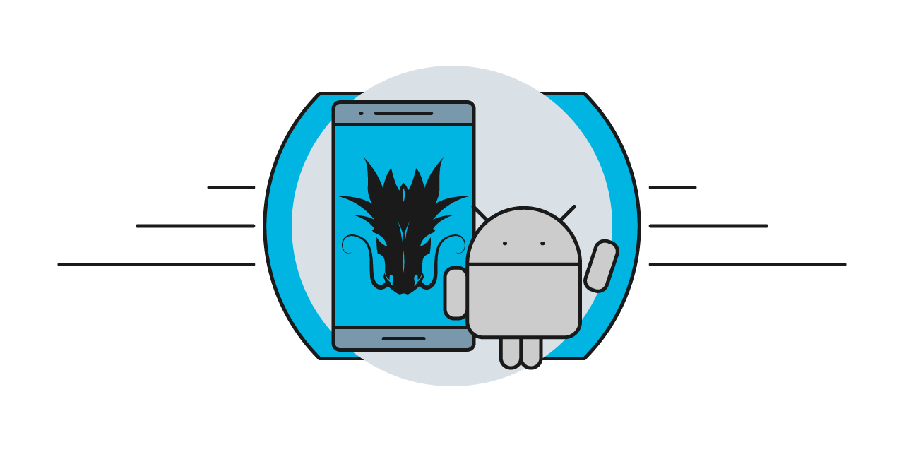

# Android Resources: Essential Elements for Developing Android Apps.

### Introduction:
This repository offers a wide range of Android content, with a focus on well-commented code. The topics covered include life cycle management, layout design, button design and implementation, implicit intents, image buttons, user input with EditText, radio buttons, checkboxes, and activities. The account also covers more advanced topics such as custom dialogs, color selection, gradient backgrounds, weather app design, audio recording, database integration, fragments, webviews, services, fingerprint authentication, app private directories, and assets folders. Additionally, the account provides resources for understanding and implementing Android design for developers, as well as samples of architecture components.

### Programming:
The majority of the demo projects use Java language.

### Coding

Most of the demo projects are in Java.

## Built With

- [00 LifeCycle](starter/00_LifeCycle/readme.md)
- [01 UserName](starter/01_UserName/readme.md)
- [01 UserName_Final](starter/01_UserName_Final/readme.md)
- [02 Layout](starter/02_Layout/readme.md)
- [02 Layouts: LinearLayout, RelativeLayout and ConstraintLayout](starter/02_Layout_Final/readme.md)
- [02 Layout centered](starter/02_LayoutCentered/readme.md)
- [03 Button_Design](starter/03_Button_Design/readme.md)
- [03 Button_Design_new](starter/03_Button_Design_new)
- [03 Button_Toast](starter/03_Button_Toast/readme.md)
- [04 Implicit Intent](starter/04_ImplicitIntent/readme.md)
- [05 Button_StartActivity](starter/05_Button_StartActivity/readme.md)
- [05 Button_StartActivity_extra](starter/05_Button_StartActivity_extra/readme.md)
- [Happy Birthday](starter/06_HappyBirthday/readme.md)
- [06 ImageButton](starter/06_ImageButton/readme.md)
- [07 EditText](starter/07_EditText/readme.md)
- [08 RadioButtons_listener](starter/08_RadioButtons_listener/readme.md)
- [-- RadioButtons_onclick](starter/08_RadioButtons_onclick/readme.md)
- [CheckBox](starter/CheckBox/readme.md)
- [Activities-AndroidTrivia](starter/Activities-AndroidTrivia)
- [TableLayout](starter/TableLayout/readme.md)
- [ListView](starter/ListView/readme.md)
- [ListView_Image_and_text](starter/ListView_Image_and_text)
- [ListViewRefreshList](starter/ListViewRefreshList)
- [ListViewPullRefresh](starter/ListViewPullRefresh)
- [Custom dialog](starter/Dialog)
- [10 GetColor](starter/10_GetColor/readme.md)
- [11 GradientBackground](starter/11_GradientBackground/readme.md)
- [12 ImplicitIntent](starter/12_ImplicitIntent/readme.md)
- [13 Weather_App_Design](starter/13_Weather_App_Design/readme.md)
- [15 ListView](starter/15_ListView/readme.md)
- [16 ListViewCustomAdapter](starter/16_ListViewCustomAdapter/readme.md)
- [17 AudioRecorder](starter/17_AudioRecorder/readme.md)
- [19 DataBase](starter/19_DataBase/readme.md)
- [20 Fragment - menu footer](starter/20_FragmentOne)
- [21 Webview](starter/21_Webview/readme.md)
- [22 ServiceDemo](starter/22_ServiceDemo/readme.md)
- [23 Service](starter/23_Service/readme.md)
- [24 Fingerprint](starter/24_Fingerprint/readme.md)
- [25 AppPrivateDirectory](starter/25_AppPrivateDirectory/readme.md)
- [26 AssetsFolder](starter/26_AssetsFolder/readme.md)
- [27 IntentExtras](starter/27_IntentExtras/readme.md)
- [28 Android Design for Developers](https://github.com/dragona/ud862-samples)
- [29 Architecture Components Samples](https://github.com/android/architecture-components-samples)

## Contributing

When contributing to this repository, please first discuss the change you wish to make via issue, email, or any other method with the owners of this repository before making a change.

## Authors

Feilong

## License
Some of the project's demos, although listed above, have their specific license. Please refer to them.
This project is licensed under the MIT License - see the [LICENSE.md](LICENSE.md) file for details

## Acknowledgments

* [Contributor Covenant](http://contributor-covenant.org)

