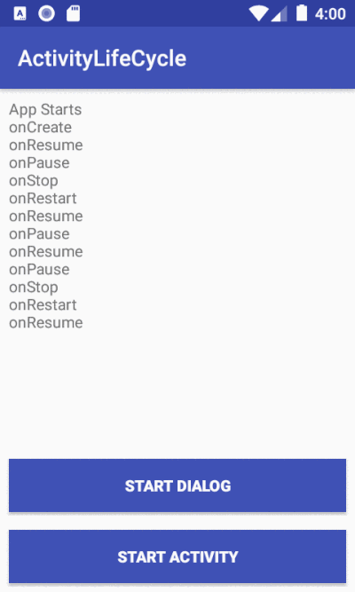
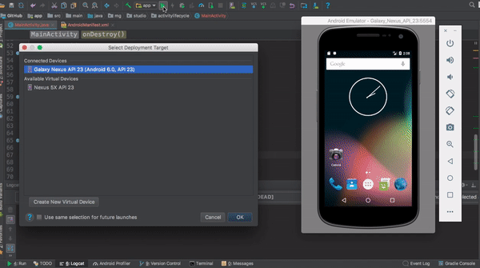
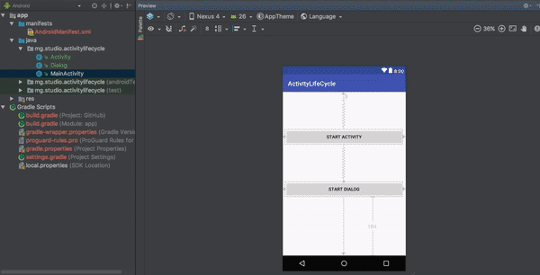
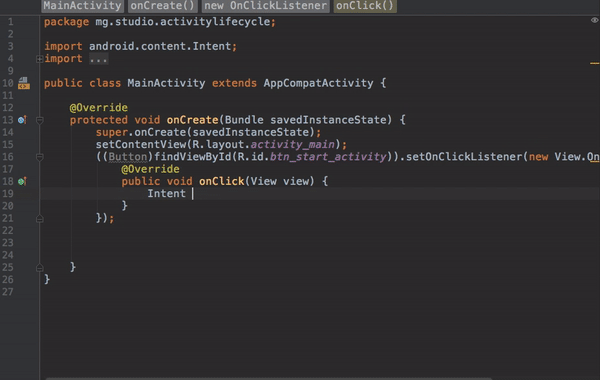
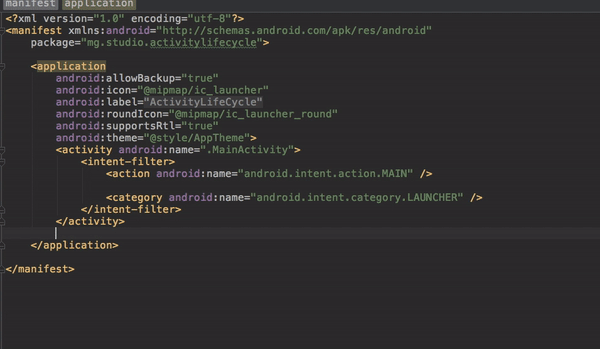

## Android Activity Lifecycle


An activity in Android is a single screen in an application that provides a user interface. The Android Activity Life Cycle is a set of methods that control the lifecycle of an activity, including its creation, visibility, and destruction. Understanding the Android Activity Life Cycle is crucial for building reliable and efficient Android applications. On this page, we will dive into the concept of activity and the different stages of the Android Activity Life Cycle.




An activity is the entry point for an app's interaction with the user and is a crucial component of an Android application. The way activities are launched and organized is a fundamental part of the Android application model. [[1](https://developer.android.com/guide/components/activities/intro-activities.html)] 

In an app, the user usually navigates through different activities, and during this interaction, activity instances go through various stages or states in their lifecycle. [[2](https://developer.android.com/guide/components/activities/activity-lifecycle.html)] 

As a developer, we can intervene in these different states using the six callbacks provided by the Activity class: `onCreate()`, `onStart()`, `onResume()`, `onPause()`, `onStop()`, and `onDestroy()`.

This demo application shows a log output each time the main activity changes state.



There are two buttons in the demo, and the following image shows how to set the `onClick` listener.



With the `onClick` listener set on the button, we can use an Intent to connect this activity and start another activity.



## The Android Manifest File

Every Android app must have an `AndroidManifest.xml` file in its root directory. This file provides important information about the app to the Android operating system (OS), which is necessary before the OS can run any of the app's code.

The manifest file includes:

- Application package name
- Application components such as activities, services, broadcast receivers, and content providers
- List of permissions required by the app

It's important to remember that all visible activities in the app must be declared in the manifest file. For instance, in this app, the activities `ActivityOne`, `Dialog`, and `ActivityTwo` are all declared in the manifest file.




```xml
<?xml version="1.0" encoding="utf-8"?>
<manifest xmlns:android="http://schemas.android.com/apk/res/android"
    package="mg.x261.lifefcycle">

    <application
        android:allowBackup="true"
        android:icon="@mipmap/ic_launcher"
        android:label="@string/app_name"
        android:roundIcon="@mipmap/ic_launcher_round"
        android:supportsRtl="true"
        android:theme="@style/Theme.LifefCycle">

        <activity
            android:name=".ActivityOne"
            android:exported="true">
            <intent-filter>
                <action android:name="android.intent.action.MAIN" />

                <category android:name="android.intent.category.LAUNCHER" />
            </intent-filter>
        </activity>
        <activity
            android:name=".ActivitySecond"
            android:exported="false" />
        <activity
            android:name=".Dialog"
            android:theme="@style/Theme.AppCompat.Dialog" />
    </application>

</manifest>

```


# ActivityOne Java Class
Here is the complete java code for the `ActivityOne` class where we can find all the overrides for the different lifecycle callbacks.


A Java class file representing an Android application activity, `ActivityOne`, is introduced. It is a subclass of `AppCompatActivity` and part of a package named `mg.x261.lifecycle`.

## Lifecycle Callbacks

The `ActivityOne` class contains several methods that override the lifecycle callbacks provided by the Android framework. These callbacks are methods executed at specific stages in the activity's lifecycle and allow developers to perform tasks such as saving data or releasing resources when necessary.

## onCreate Method

In the `onCreate` method, the view of the activity is set and two `OnClickListeners` are added to two buttons in the view. The first `OnClickListener` starts another activity named `ActivitySecond` when the button is clicked. The second `OnClickListener` starts a dialog activity named `Dialog` when the button is clicked.

## Other Lifecycle Callbacks

The other lifecycle callback methods log the execution of the method using the `Log.d` method, set the value of the `currentState` variable to reflect the current lifecycle state of the activity, and update the text in a text view in the activity's view. The `setText` method retrieves the current text from the text view and adds the current lifecycle state to it before setting it back as the text of the view.

## Handling Activity Lifecycle

This code is an example of how to handle the different lifecycle stages of an Android activity and perform tasks in response to changes in the activity's state.


```java
package mg.x261.lifefcycle;

import android.content.Intent;
import android.os.Bundle;
import android.util.Log;
import android.view.View;
import android.widget.TextView;

import androidx.appcompat.app.AppCompatActivity;

public class ActivityOne extends AppCompatActivity {

    // Logging tag for ActivityOne
    private final String TAG = "TAG_" + getClass().getSimpleName();

    // String to store the current state
    private String currentState = null;

    @Override
    protected void onCreate(Bundle savedInstanceState) {
        super.onCreate(savedInstanceState);
        setContentView(R.layout.activity_main);

        // Log the onCreate state
        Log.d(TAG, "onCreate:" + TAG);
        currentState = "onCreate";
        setText();

        // Setting an OnClickListener for the "Start Activity" button
        findViewById(R.id.btn_start_activity).setOnClickListener(new View.OnClickListener() {
            @Override
            public void onClick(View view) {
                Intent mIntent = new Intent(getBaseContext(), ActivitySecond.class);
                startActivity(mIntent);
            }
        });

        // Setting an OnClickListener for the "Start Dialog" button
        findViewById(R.id.btn_start_dialog).setOnClickListener(new View.OnClickListener() {
            @Override
            public void onClick(View view) {
                startActivity(new Intent(getBaseContext(), Dialog.class));
            }
        });
    }

    @Override
    protected void onResume() {
        super.onResume();
        // Log the onResume state
        Log.d(TAG, "onResume: " + TAG);
        currentState = "onResume";
        setText();
    }

    @Override
    protected void onRestart() {
        super.onRestart();
        // Log the onRestart state
        Log.d(TAG, "onRestart: " + TAG);
        currentState = "onRestart";
        setText();
    }

    @Override
    protected void onPause() {
        super.onPause();
        // Log the onPause state
        Log.d(TAG, "onPause: " + TAG);
        currentState = "onPause";
        setText();
    }

    @Override
    protected void onStop() {
        super.onStop();
        // Log the onStop state
        Log.d(TAG, "onStop: " + TAG);
        currentState = "onStop";
        setText();
    }

    @Override
    protected void onDestroy() {
        super.onDestroy();
        // Log the onDestroy state
        Log.d(TAG, "onDestroy: " + TAG);
        currentState = "onDestroy";
        setText();
    }

    // Method to set the text of the display
    private void setText() {
        // Get the previous content of the display
        String previousContent = ((TextView) findViewById(R.id.display)).getText().toString();

        // Set the text of the display 
        ((TextView) findViewById(R.id.display)).setText(previousContent + "\n" + currentState);
    }

}

```
