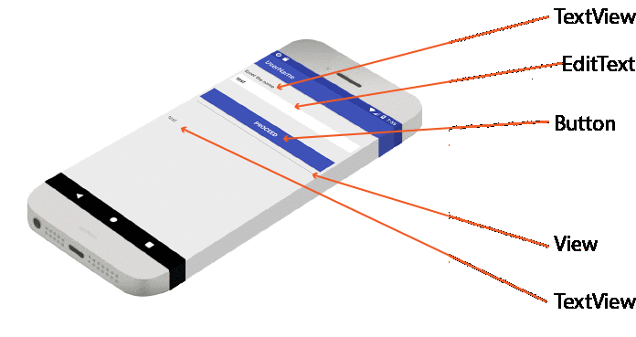
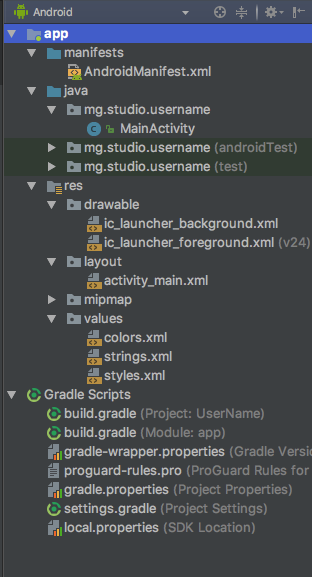
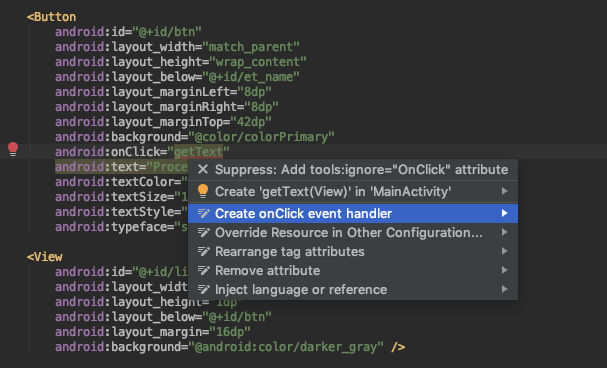
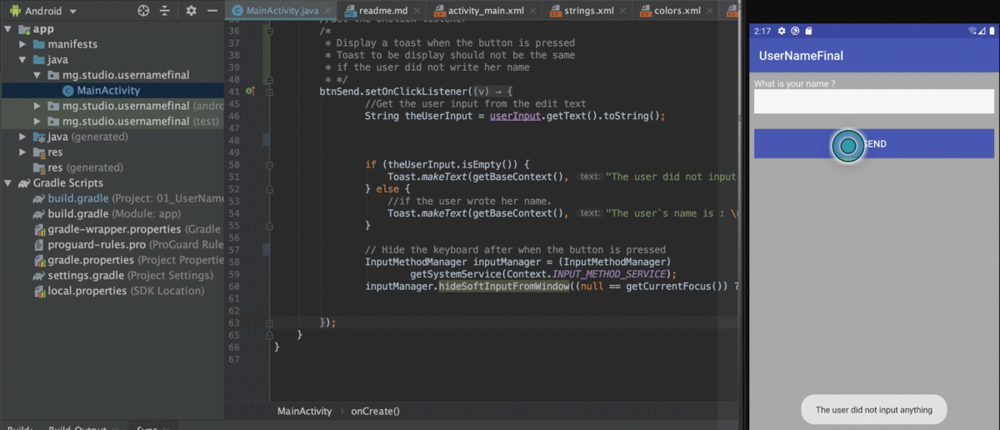

## User Input in Android (Java)

This Android app lets users enter text into an `EditText` field. When text is entered and the "Proceed" button is pressed, the app retrieves the input text and displays it in a `TextView` below the button.

### Problem Breakdown

#### Components
- TextView
- EditText
- Button
- View

Here's a visual representation:




#### Feature Selection
The application will have two versions:

##### Version 1
- [ ] Single activity
- [ ] "Enter the name" displayed in a TextView
- [ ] EditText to retrieve user input
- [ ] "Proceed" button retrieves input text and displays it in a TextView below the button
- [ ] A view separates the button and the TextView

##### Version 2
- [ ] All features from Version 1
- [ ] User input validation
  - [ ] Informative toast if button is pressed but editText is empty
  - [ ] Trailing spaces removed from user input
- [ ] EditText cleared after button press

#### Final Product
Here's what the completed Version 2 will look like:

##### Building Version 1
To build Version 1, follow these steps:

1. Create a new app with one activity using Android Studio




2. Edit these files:
   - manifest.xml
   - MainActivity.java
   - activity_main.xml

#### manifest.xml

```xml
<?xml version="1.0" encoding="utf-8"?>
<manifest xmlns:android="http://schemas.android.com/apk/res/android"
    package="mg.x261.username">

    <application
        android:allowBackup="true"
        android:icon="@mipmap/ic_launcher"
        android:label="@string/app_name"
        android:roundIcon="@mipmap/ic_launcher_round"
        android:supportsRtl="true"
        android:theme="@style/AppTheme">
        <activity android:name=".MainActivity">
            <intent-filter>
                <action android:name="android.intent.action.MAIN" />

                <category android:name="android.intent.category.LAUNCHER" />
            </intent-filter>
        </activity>
    </application>

</manifest>
```

#### MainActivity.java

```Java
package mg.x261.username;

import android.os.Bundle;

import androidx.appcompat.app.AppCompatActivity;

public class MainActivity extends AppCompatActivity {

    @Override
    protected void onCreate(Bundle savedInstanceState) {
        super.onCreate(savedInstanceState);
        setContentView(R.layout.activity_main);
    }


}
```

#### activity_main.xml


```xml
<?xml version="1.0" encoding="utf-8"?>
<android.support.constraint.ConstraintLayout xmlns:android="http://schemas.android.com/apk/res/android"
    xmlns:app="http://schemas.android.com/apk/res-auto"
    xmlns:tools="http://schemas.android.com/tools"
    android:layout_width="match_parent"
    android:layout_height="match_parent"
    tools:context="mg.x261.username.MainActivity">

    <TextView
        android:layout_width="wrap_content"
        android:layout_height="wrap_content"
        android:text="Hello World!"
        app:layout_constraintBottom_toBottomOf="parent"
        app:layout_constraintLeft_toLeftOf="parent"
        app:layout_constraintRight_toRightOf="parent"
        app:layout_constraintTop_toTopOf="parent" />

</android.support.constraint.ConstraintLayout>

```

Notice the main layout of our activity_main.xml is a

```
android.support.constraint.ConstraintLayout
```

We just completed the project creation, which has a single activity.

- [ ] Features version 1
  - [x] the application has a single activity.
  - [ ] the application has a text view that displays "Enter the name"
  - [ ] the application has an editText that will be used to retrieve the user input.
  - [ ] the application has a button named "Proceed". When this button is pressed, the text from the editText is retrieved and displayed in a textview below the button
  - [ ] the application has a textview below the button to show the text inserted by the user
  - [ ] a view (in our case here, it is line) separates the button and the textview below it.


I prefer using a RelativeLayout, that said I will change the above accordingly.

To add a textview to the application, let's open the ```activity_main.xml``` file and add the following:
Remove the ```android.support.constraint.ConstraintLayout```from the top and bottom line and replace them with ```RelativeLayout```


```xml

<?xml version="1.0" encoding="utf-8"?>
<RelativeLayout xmlns:android="http://schemas.android.com/apk/res/android"
    xmlns:tools="http://schemas.android.com/tools"
    android:layout_width="match_parent"
    android:layout_height="match_parent"
    android:background="#ebeaeb"
    tools:context="mg.x261.username.MainActivity">


</RelativeLayout>

```

now, to add the ```textView```, add the following inside your ```RelativeLayout```

```xml
    <TextView
        android:id="@+id/tv_title"
        android:layout_width="match_parent"
        android:layout_height="wrap_content"
        android:layout_alignParentTop="true"
        android:layout_marginLeft="8dp"
        android:layout_marginTop="24dp"
        android:text="Enter the name"
        android:textStyle="bold" />
```


So far, your ```activity_main.xml``` should be similar to this:

```xml
<?xml version="1.0" encoding="utf-8"?>
<RelativeLayout xmlns:android="http://schemas.android.com/apk/res/android"
    xmlns:tools="http://schemas.android.com/tools"
    android:layout_width="match_parent"
    android:layout_height="match_parent"
    android:background="#ebeaeb"
    tools:context="mg.x261.username.MainActivity">
    <TextView
        android:id="@+id/tv_title"
        android:layout_width="match_parent"
        android:layout_height="wrap_content"
        android:layout_alignParentTop="true"
        android:layout_marginLeft="8dp"
        android:layout_marginTop="24dp"
        android:text="Enter the name"
        android:textStyle="bold" />
</RelativeLayout>

```

Except this ```tools:context="mg.x261.username.MainActivity"```, where you should have the inverse domain name you used when creating the project.

Test your application; you should have something that looks like this

We just finished adding the textview, it is now time to add the edittext, a button, a view (line), and the second textview for getting the user input.

- [ ] Features version 1
  - [x] the application has a single activity.
  - [x] the application has a text view that displays "Enter the name"
  - [ ] the application has an editText that will be used to retrieve the user input.
  - [ ] the application has a button named "Proceed". When this button is pressed, the text from the editText is retrieved and displayed in a textview below the button
  - [ ] the application has a textview below the button to show the text inserted by the user
  - [ ] a view (line) separates the button and the textview below it


```xml
<?xml version="1.0" encoding="utf-8"?>
<RelativeLayout xmlns:android="http://schemas.android.com/apk/res/android"
    xmlns:tools="http://schemas.android.com/tools"
    android:layout_width="match_parent"
    android:layout_height="match_parent"
    android:background="#ebeaeb"
    tools:context="mg.x261.username.MainActivity">

    <TextView
        android:id="@+id/tv_title"
        android:layout_width="match_parent"
        android:layout_height="wrap_content"
        android:layout_alignParentTop="true"
        android:layout_marginLeft="8dp"
        android:layout_marginTop="24dp"
        android:text="Enter the name"
        android:textStyle="bold" />

    <EditText
        android:id="@+id/et_name"
        android:layout_width="match_parent"
        android:layout_height="wrap_content"
        android:layout_below="@+id/tv_title"
        android:layout_margin="8dp"
        android:background="@android:color/white"
        android:inputType="text"
        android:maxLength="50"
        android:padding="8dp"
        android:singleLine="true"
        android:textCursorDrawable="@android:color/darker_gray"
        android:textSize="15sp" />

    <Button
        android:id="@+id/btn"
        android:layout_width="match_parent"
        android:layout_height="wrap_content"
        android:layout_below="@+id/et_name"
        android:layout_marginLeft="8dp"
        android:layout_marginRight="8dp"
        android:layout_marginTop="42dp"
        android:background="@color/colorPrimary"
        android:onClick="getText"
        android:text="Proceed"
        android:textColor="@android:color/white"
        android:textSize="16sp"
        android:textStyle="bold"
        android:typeface="sans" />

    <View
        android:id="@+id/line"
        android:layout_width="match_parent"
        android:layout_height="1dp"
        android:layout_below="@+id/btn"
        android:layout_margin="16dp"
        android:background="@android:color/darker_gray" />

    <TextView
        android:id="@+id/display"
        android:layout_width="match_parent"
        android:layout_height="match_parent"
        android:layout_below="@+id/line"
        android:layout_marginBottom="8dp"
        android:layout_marginLeft="8dp"
        android:layout_marginRight="8dp"
        android:layout_marginTop="54dp"
        android:padding="8dp" />

</RelativeLayout>

```
Now that we have our layout ready, you can run the application and test it. How does it look like?

- [ ] Features version 1
  - [x] the application has a single activity.
  - [x] the application has a text view that displays "Enter the name"
  - [x] the application has an editText that will be used to retrieve the user input.
  - [ ] the application has a button named "Proceed". When this button is pressed, the text from the editText is retrieved and displayed in a textview below the button
  - [x] the application has a text view below the button to show the text inserted by the user
  - [x] a view (line) separates the button and the text view below it


Time to work on our java file. Notice the ids ```display```, ```btn```, and ```et_name``` as we need to use them in the java file to refer to the views.

```Java
package mg.x261.username;

import android.os.Bundle;

import androidx.appcompat.app.AppCompatActivity;

public class MainActivity extends AppCompatActivity {

    @Override
    protected void onCreate(Bundle savedInstanceState) {
        super.onCreate(savedInstanceState);
        setContentView(R.layout.activity_main);
    }


}
```

To connect your button view with your java file, you can go back to your ```activity_main.xml``` and over the ```onClick``` under your button, you should bet something that looks like this



and this will create a method inside your ```MainActivity.java```

```java
    /** your previous code */    
    public void getText(View view) {
    
    }

```

You can write your code logic to be executed inside that getText.

```Java
            TextView mDisplay = findViewById(R.id.display);
            EditText mEditText = findViewById(R.id.et_name);
            mDisplay.setText(mEditText.getText().toString());
```

Now, your complete MainActivity.java file should look like [this](app/src/main/java/mg/studio/username/MainActivity.java)

- [ ] Features version 1
  - [x] the application has a single activity.
  - [x] the application has a text view that displays "Enter the name"
  - [x] the application has an editText that will be used to retrieve the user input.
  - [x] the application has a button named "Proceed". When this button is pressed, the text from the editText is retrieved and displayed in a text view below the button
  - [x] the application has a text view below the button to show the text inserted by the user
  - [x] a view (line) separates the button and the textview below it


We completed version 1


Not, it is up to you to update this application and complete version 2.


- [ ] Features version 2
  - [ ] all the features of version 1
  - [ ] validate the user input
    - [ ] display an informative toast if user presses the button Process but the edit text is empty.
    - [ ] remove the trailing spaces form the user input
  - [ ] clear the edit text after the user presses the button
  - [ ] hide the keyboard when the text is shown on the textview

Feel free to check [this](https://github.com/dragona/android-intro/tree/master/01_UserName_Final)


    
