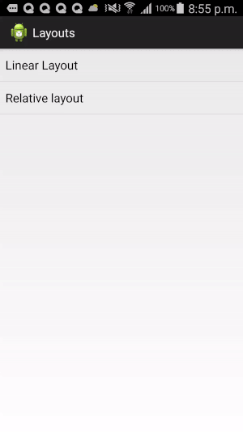
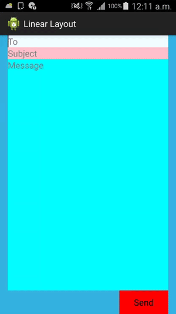
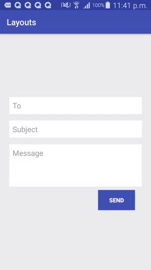

##  LinearLayout and RelativeLayout

You are provided two layout files, one using ```LinearLayout``` and the other using ```RelativeLayout```.




The ```linear_layout.xml``` has a ```vertical orientation``` and the inner views are set to ```wrap_content``` except 
the ```EditText``` for the message which has a ```android:layout_height="0dp"``` and a ```android:layout_weight="1"```


```xml
<?xml version="1.0" encoding="utf-8"?>
<LinearLayout xmlns:android="http://schemas.android.com/apk/res/android"
    android:layout_width="fill_parent"
    android:layout_height="fill_parent"
    android:background="@color/dodgerblue"
    android:orientation="vertical"
    android:paddingLeft="16dp"
    android:paddingRight="16dp" >

    <EditText
        android:layout_width="fill_parent"
        android:layout_height="wrap_content"
        android:background="@color/azure"
        android:hint="@string/to" />

    <EditText
        android:layout_width="fill_parent"
        android:layout_height="wrap_content"
        android:background="@color/pink"
        android:hint="@string/subject" />

    <EditText
        android:layout_width="fill_parent"
        android:layout_height="0dp"
        android:layout_weight="1"
        android:background="@color/cyan"
        android:gravity="top"
        android:hint="@string/message" />

    <Button
        android:layout_width="100dp"
        android:layout_height="wrap_content"
        android:layout_gravity="right"
        android:background="@color/red"
        android:text="@string/send" />

</LinearLayout>
```


and the version in ```RelativeLayout``` gives:

```xml

<?xml version="1.0" encoding="utf-8"?>
<RelativeLayout xmlns:android="http://schemas.android.com/apk/res/android"
    android:layout_width="match_parent"
    android:layout_height="match_parent"
    android:background="@color/dodgerblue"
    android:padding="16dp" >

    <EditText
        android:id="@+id/name"
        android:layout_width="fill_parent"
        android:layout_height="wrap_content"
        android:background="@color/pink"
        android:hint="@string/reminder" />

    <EditText
        android:id="@+id/dates"
        android:layout_width="0dp"
        android:layout_height="wrap_content"
        android:layout_alignParentLeft="true"
        android:layout_below="@id/name"
        android:layout_toLeftOf="@+id/times"
        android:background="@color/darkolivegreen"
        android:hint="@string/date" />

    <EditText
        android:id="@id/times"
        android:layout_width="96dp"
        android:layout_height="wrap_content"
        android:layout_alignParentRight="true"
        android:layout_below="@id/name"
        android:background="@color/beige"
        android:hint="@string/time" />

    <Button
        android:layout_width="96dp"
        android:layout_height="wrap_content"
        android:layout_alignParentRight="true"
        android:layout_below="@id/times"
        android:background="@color/greenyellow"
        android:text="@string/done" />

</RelativeLayout>
```


The design in the LinearLayout above was updated to get this.



The xml for this updated version looks like this


See if you can implement an improved version of the above design but this time, 
using a ConstraintLayout combined with a ScrollView, a RelativeLayout, and a LinearLayout if all needed. 
Your final result should look like this

 

