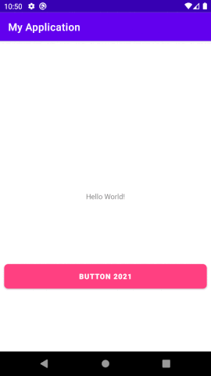

# Android button design - with selector (2021)



If you have a project that makes use of

```xml
    implementation 'com.google.android.material:material:x.x.x'
```

and after checking the [button design](https://github.com/dragona/android-intro/blob/master/03_Button_Design/readme.md) you tried
adding selectors to change the button's color when it is pressed like this

```xml
 <Button
        android:id="@+id/btn_six"
        android:layout_width="match_parent"
        android:layout_height="wrap_content"
        android:text="Button Six - button selector"
        android:layout_margin="8dp"
        android:background="@drawable/button_selector"
        android:textColor="@android:color/white"
        android:textStyle="bold"/>
```

You need to consider adding

```xml
    app:backgroundTint="@null"
```

to see the effect of the background change. Thus the ```Button``` would then be something like this

```xml
    <Button
        android:id="@+id/btn_new"
        android:layout_width="match_parent"
        android:layout_height="wrap_content"
        android:layout_margin="8dp"
        android:background="@drawable/button_selector"
        android:onClick="btlClick"
        android:text="Button 2021"
        android:textColor="@android:color/white"
        android:textStyle="bold"
        app:backgroundTint="@null"
        app:layout_constraintBottom_toBottomOf="parent"
        app:layout_constraintEnd_toEndOf="parent"
        app:layout_constraintStart_toStartOf="parent"
        app:layout_constraintTop_toBottomOf="@+id/textView" />
```

To recap, there 4 files that require change to get the selector work in this example are:

1- The layout that contains the button:
 - should use the drawable ```button_selector.xml``` and set the backgroundTint to ```@null```
```xml
        android:background="@drawable/button_selector"
        app:backgroundTint="@null"
```

2- Add the 3 files
```
    - button_selector.xml
    - button_shape.xml
    - button_shape_pressed.xml
```


