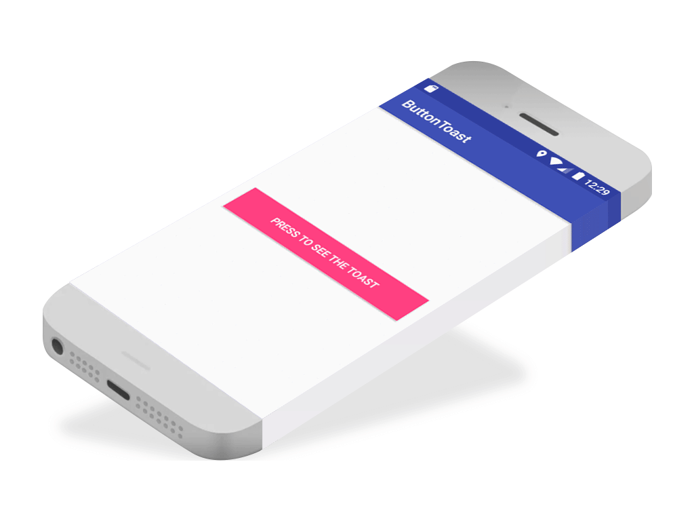

# Create a Toast in Android



This is the only line added to get the toast (considering that you already have the button ready)

```java
    Toast.makeText(this, "You clicked the button, this is a Toast.", Toast.LENGTH_LONG).show();
```

 

