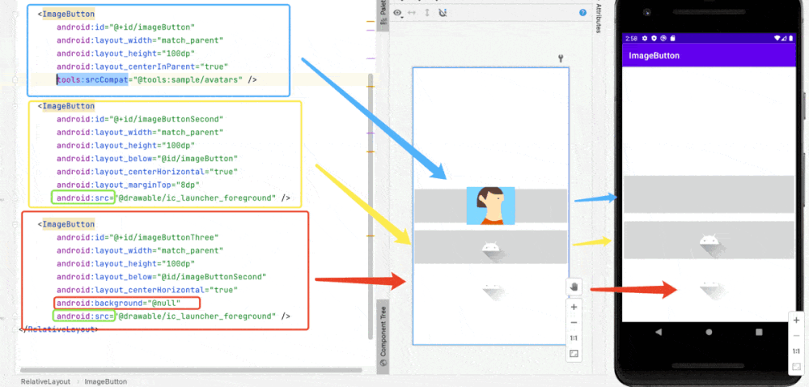

# ImageButton

Notice the use of ```src``` for specifying the image source and ```android:background="@null"```
to get rid of the background.

```xml
    <ImageButton
        android:id="@+id/imageButtonThree"
        android:layout_width="match_parent"
        android:layout_height="100dp"
        android:layout_below="@id/imageButtonSecond"
        android:layout_centerHorizontal="true"
        android:background="@null"
        android:src="@drawable/ic_launcher_foreground" />
```

