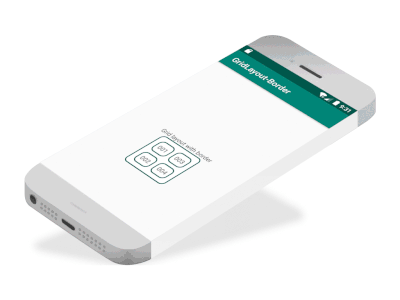

# Adding a border to a GridView



Create a border layout file and apply it as a background each View or to the GroupView

```xml
<?xml version="1.0" encoding="utf-8"?>
<shape xmlns:android="http://schemas.android.com/apk/res/android">
    <solid android:color="#FFFFFF" />
    <stroke
        android:width="2dp"
        android:color="@color/colorPrimaryDark" />
    <corners android:radius="10dip" />
    <padding
        android:bottom="8dp"
        android:left="8dp"
        android:right="8dp"
        android:top="8dp" />
</shape>
```