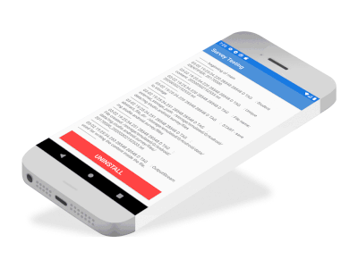

- [x] print logcat in a TextView and initiate Uninstall within app
- [x] initiate Uninstall within app
- [x] save file in external storage using GetExternalFilesDir

## snippet:


### initiate Uninstall within app 
```java
        // Uninstall the app
        Intent intent = new Intent(Intent.ACTION_DELETE);
        intent.setData(Uri.parse("package:mg.studio.android.survey"));
        this.finish(); // finish the current activity
        startActivity(intent);
```

### save file in external storage using GetExternalFilesDir

```java
    /**
     * Location: The exact location of where your files can be saved might vary across devices.
     * One example location is on an AVD with API 29
     * /storage/emulated/0/Android/data/mg.studio.android.survey/files
     * Permission: Not needed for external storage when your app is used on devices
     * that run Android 4.4 (API level 19) or higher
     */
    private void saveExternalStorageGetExternalFilesDir() {

        /**
         *  check availability  and  not write protection status
         */

        String en = Environment.getExternalStorageState();
        if (en.equals(Environment.MEDIA_MOUNTED)) {
            SimpleDateFormat simpleDateFormat = new SimpleDateFormat("yyyyMMddHHmmss");
            Date date = new Date(System.currentTimeMillis());
            String fileName = simpleDateFormat.format(date) + ".txt";
            // Get app specific location for external storage
            // The exact location of where your files can be saved might vary across devices.
            // For this reason, don't use hard-coded file paths.
            String external_storage_path = getExternalFilesDir(null).getAbsolutePath();
            Log.d("TAG", "external_storage_path:  " + external_storage_path);

            // Create the external directory
            File abstract_file_dir = new File(external_storage_path);
            Log.d("TAG", "abstract_file_dir:  " + abstract_file_dir);

            // Ensure external directory exists
            if (!abstract_file_dir.exists()) {
                Log.e("TAG", "!abstract_file_dir.exists(): directory creation failed");
                if (!abstract_file_dir.mkdirs()) {
                    return;
                }
            }

            // create a file within the external directory
            File file = new File(external_storage_path + File.separator + file_name);
            Log.d("TAG", "File created: " + file);

            try {
                if (!file.exists()) {
                    if (!file.createNewFile()) {
                        Log.e("TAG", "!file.createNewFile(): file creation failed");
                        return;
                    }
                }
                // Use PrintSteam to write (print) the content inside the file
                PrintStream outputStream = new PrintStream(new FileOutputStream(file));
                outputStream.print(content);
                outputStream.close();
                Log.d("TAG", "OutputStream used for writing the content inside the file.");
            } catch (Exception e) {
                Log.e("TAG", "Error : " + e);
                return;
            }
        } else {
            String error = "Error : External storage not available.";
            Log.e("TAG", error);
            Toast.makeText(this, error, Toast.LENGTH_LONG).show();
        }
    }
``` 
