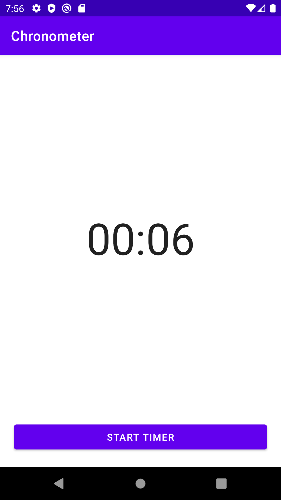

# Simple timer



```java
package mg.x261.chronometer;

import androidx.appcompat.app.AppCompatActivity;

import android.os.Bundle;
import android.os.SystemClock;
import android.view.View;
import android.widget.Button;
import android.widget.Chronometer;

public class MainActivity extends AppCompatActivity {
    private Chronometer timerDisplay;
    private Button startStopButton;
    Boolean isTimerRunning = false;

    @Override
    protected void onCreate(Bundle savedInstanceState) {
        super.onCreate(savedInstanceState);
        setContentView(R.layout.activity_main);
        timerDisplay = findViewById(R.id.timerDisplay);
        startStopButton = findViewById(R.id.startStopButton);
        startStopButton.setText("Start timer");
    }

    public void btnController(View view) {
        if (!isTimerRunning) {
            startTimer();
        } else {
            stopTimer();
        }
    }

    private void startTimer() {
        timerDisplay.setBase(SystemClock.elapsedRealtime());
        timerDisplay.start();
        isTimerRunning = true;
        startStopButton.setText("Stop timer");
    }

    private void stopTimer() {
        timerDisplay.stop();
        isTimerRunning = false;
        startStopButton.setText("Start timer");
    }
}

```

Here is the layout

```xml
<?xml version="1.0" encoding="utf-8"?>
<androidx.constraintlayout.widget.ConstraintLayout xmlns:android="http://schemas.android.com/apk/res/android"
    xmlns:app="http://schemas.android.com/apk/res-auto"
    xmlns:tools="http://schemas.android.com/tools"
    android:layout_width="match_parent"
    android:layout_height="match_parent"
    tools:context=".MainActivity">

    <Chronometer
        android:id="@+id/timerDisplay"
        android:layout_width="wrap_content"
        android:layout_height="wrap_content"
        android:textSize="64sp"
        app:layout_constraintBottom_toTopOf="@+id/startStopButton"
        app:layout_constraintEnd_toEndOf="parent"
        app:layout_constraintStart_toStartOf="parent"
        app:layout_constraintTop_toTopOf="parent"
        app:layout_constraintVertical_bias="0.5" />

    <Button
        android:id="@+id/startStopButton"
        android:layout_width="match_parent"
        android:layout_height="wrap_content"
        android:layout_marginStart="20dp"
        android:layout_marginEnd="20dp"
        android:layout_marginBottom="20dp"
        android:onClick="btnController"
        android:text="Start timer"
        app:layout_constraintBottom_toBottomOf="parent"
        app:layout_constraintEnd_toEndOf="parent"
        app:layout_constraintStart_toStartOf="parent"
        app:layout_constraintVertical_bias="1.0" />


</androidx.constraintlayout.widget.ConstraintLayout>
```

The implementation of this timer will not continue running if the app is closed. When the app is
closed, the activity and its associated resources, including the Chronometer, will be destroyed.
Therefore, the timer will stop and its current state will be lost.

If you want the timer to continue running even when the app is closed or the device is restarted,
you can consider using a Service or a BroadcastReceiver. A Service is a component that runs in the
background, independent of any activity or UI. By using a Service, you can ensure that the timer
continues running even when the app is closed or the device is restarted.

Here's an example of how you could modify the code to use a Service:

```java

public class TimerService extends Service {
    private static final String TAG = "TimerService";
    private Chronometer timer;
    private Boolean isRunning = false;

    @Override
    public void onCreate() {
        super.onCreate();
        timer = new Chronometer(this);
        timer.setBase(SystemClock.elapsedRealtime());
    }

    @Override
    public int onStartCommand(Intent intent, int flags, int startId) {
        if (!isRunning) {
            timer.start();
            isRunning = true;
        }
        return START_STICKY;
    }

    @Override
    public void onDestroy() {
        super.onDestroy();
        timer.stop();
        isRunning = false;
    }

    @Override
    public IBinder onBind(Intent intent) {
        return null;
    }
}

```

You need to add the TimerService component in the AndroidManifest.xml file by including a <service> element inside the <application> element. The android:name attribute specifies the fully qualified name of the TimerService class, including the package name. This tells the Android system that the TimerService component exists and can be used by other components in the app.
Then Modify the MainActivity to start and stop the TimerService:

```xml
        <service android:name=".TimerService" />
```
```java
package mg.x261.chronometer;

import android.app.ActivityManager;
import android.content.Context;
import android.content.Intent;
import android.os.Bundle;
import android.view.View;
import android.widget.Button;

import androidx.appcompat.app.AppCompatActivity;

public class MainActivityCallingService extends AppCompatActivity {
    private Button startStopButton;
    private Intent serviceIntent;

    @Override
    protected void onCreate(Bundle savedInstanceState) {
        super.onCreate(savedInstanceState);
        setContentView(R.layout.activity_main);
        startStopButton = findViewById(R.id.startStopButton);
        startStopButton.setText("Start Timer");
        serviceIntent = new Intent(this, TimerService.class);
    }

    public void btnController(View view) {
        if (!isTimerRunning()) {
            startTimer();
        } else {
            stopTimer();
        }
    }

    private void startTimer() {
        startService(serviceIntent);
        startStopButton.setText("Stop timer");
    }

    private void stopTimer() {
        stopService(serviceIntent);
        startStopButton.setText("Start timer");
    }

    private boolean isTimerRunning() {
        ActivityManager manager = (ActivityManager) getSystemService(Context.ACTIVITY_SERVICE);
        for (ActivityManager.RunningServiceInfo service : manager.getRunningServices(Integer.MAX_VALUE)) {
            if (TimerService.class.getName().equals(service.service.getClassName())) {
                return true;
            }
        }
        return false;
    }
}


```


In this updated code, the MainActivity starts and stops the TimerService by using an Intent. The TimerService uses a Chronometer to keep track of the elapsed time, and it starts and stops the timer in its onStartCommand and onDestroy methods. The MainActivity checks if the TimerService is running by using the ActivityManager, and it updates the button text accordingly. With this implementation, the timer will continue running even if the app is closed or the device is restarted.

At this stage, things should be working good, but if you run the app and test it, you should notice that the timer UI does not get updated.


In order to update the timer UI, you need to send a broadcast from the TimerService to the MainActivity, and update the UI in the MainActivity based on the broadcast.

Here's an updated TimerService that sends a broadcast every second:

```java 
package mg.x261.chronometer;

import android.app.Service;
import android.content.Intent;
import android.os.Handler;
import android.os.IBinder;
import android.os.SystemClock;
import android.widget.Chronometer;


public class TimerService extends Service {
    private static final String TAG = "TimerService";
    private Chronometer timer;
    private Boolean isRunning = false;
    public static final String TIMER_UPDATE_ACTION = "mg.x261.chronometer.TIMER_UPDATE_ACTION";

    @Override
    public void onCreate() {
        super.onCreate();
        timer = new Chronometer(this);
        timer.setBase(SystemClock.elapsedRealtime());
    }

    @Override
    public int onStartCommand(Intent intent, int flags, int startId) {
        if (!isRunning) {
            timer.start();
            isRunning = true;
            sendTimerUpdateBroadcast();
        }
        return START_STICKY;
    }

    @Override
    public void onDestroy() {
        super.onDestroy();
        timer.stop();
        isRunning = false;
    }

    @Override
    public IBinder onBind(Intent intent) {
        return null;
    }

    private void sendTimerUpdateBroadcast() {
        Intent intent = new Intent(TIMER_UPDATE_ACTION);
        intent.putExtra("time", SystemClock.elapsedRealtime() - timer.getBase());
        sendBroadcast(intent);
        handler.postDelayed(timerRunnable, 1000);
    }

    private Handler handler = new Handler();
    private Runnable timerRunnable = new Runnable() {
        @Override
        public void run() {
            sendTimerUpdateBroadcast();
        }
    };
}

```

and the updated MainActivity that listens for the broadcast and updates the UI:

```java
package mg.x261.chronometer;

import android.app.ActivityManager;
import android.content.BroadcastReceiver;
import android.content.Context;
import android.content.Intent;
import android.content.IntentFilter;
import android.os.Bundle;
import android.view.View;
import android.widget.Button;
import android.widget.TextView;

import androidx.appcompat.app.AppCompatActivity;

public class MainActivityCallingService extends AppCompatActivity {
    private Button startStopButton;
    private Intent serviceIntent;
    private TextView timerDisplay;
    private boolean isTimerRunning = false;

    /**
     * Broadcast receiver that listens for timer update broadcasts sent by the TimerService
     */
    private BroadcastReceiver timerBroadcastReceiver = new BroadcastReceiver() {
        /**
         * Called when a timer update broadcast is received
         * @param context the context in which the broadcast was received
         * @param intent the intent that contains the broadcast data
         */
        @Override
        public void onReceive(Context context, Intent intent) {
            // Extract the elapsed time from the broadcast intent
            long time = intent.getLongExtra("time", 0);

            // Update the timer display with the new elapsed time
            updateTimerDisplay(time);
        }
    };


    @Override
    protected void onCreate(Bundle savedInstanceState) {
        super.onCreate(savedInstanceState);
        setContentView(R.layout.activity_main);
        startStopButton = findViewById(R.id.startStopButton);
        startStopButton.setText("Start Timer");
        timerDisplay = findViewById(R.id.timerDisplay);
        serviceIntent = new Intent(this, TimerService.class);
    }

    /**
     * Called when the activity is starting
     */
    @Override
    protected void onStart() {
        // Call the superclass implementation of onStart
        super.onStart();

        // Register the timer broadcast receiver to receive timer update broadcasts from the TimerService
        registerReceiver(timerBroadcastReceiver, new IntentFilter(TimerService.TIMER_UPDATE_ACTION));
    }


    @Override
    protected void onStop() {
        super.onStop();
        unregisterReceiver(timerBroadcastReceiver);
    }

    public void btnController(View view) {
        if (!isTimerRunning) {
            startTimer();
        } else {
            stopTimer();
        }
    }

    private void startTimer() {
        startService(serviceIntent);
        startStopButton.setText("Stop Timer");
        isTimerRunning = true;
    }

    private void stopTimer() {
        stopService(serviceIntent);
        startStopButton.setText("Start Timer");
        isTimerRunning = false;
    }

    private void updateTimerDisplay(long time) {
        long seconds = (time / 1000) % 60;
        long minutes = (time / 60000) % 60;
        long hours = (time / 3600000);
        timerDisplay.setText(String.format("%02d:%02d:%02d", hours, minutes, seconds));
    }
}

```

This last approach can continue to update the timer even if the activity is closed.

The Service continues to run in the background and sends broadcast updates to the activity, even if the activity is closed.

However, it's worth noting that if the app is force-stopped (for example, by the user through the app settings or by the system due to low memory), the Service will also be stopped, and the timer will stop updating. To ensure that the timer continues to run even if the app is force-stopped, you could consider using a foreground Service.

