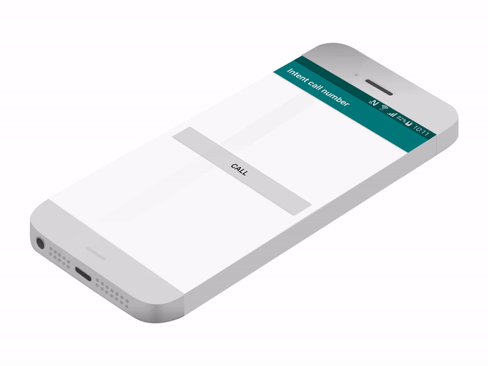

# Use an intent to open the phone dialer

Here is the code that you need.

```java
        Intent intent = new Intent(Intent.ACTION_DIAL);
        intent.setData(Uri.parse("tel:520510"));
        startActivity(intent);

```

or if you prefer the online version

```java
        startActivity(new Intent(Intent.ACTION_DIAL).setData(Uri.parse("tel:520510")));
```