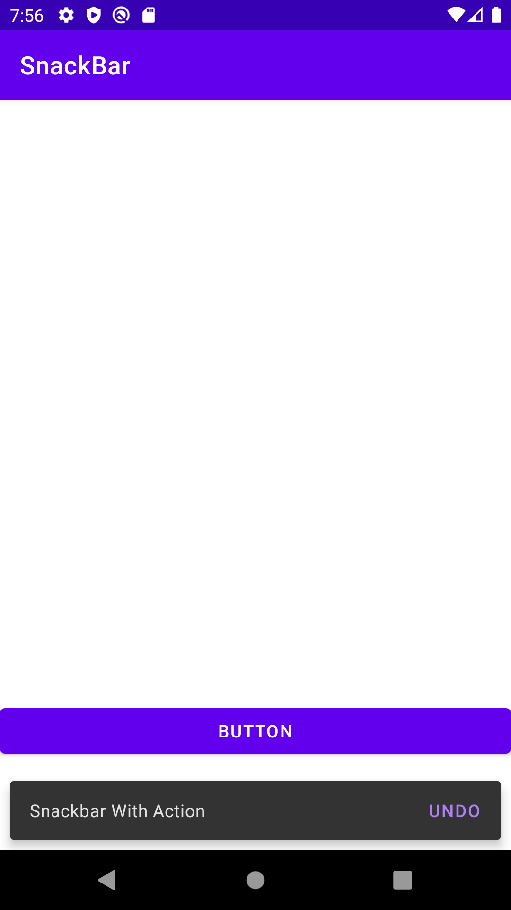

# Snackbar



```xml
<?xml version="1.0" encoding="utf-8"?>
<androidx.coordinatorlayout.widget.CoordinatorLayout
    xmlns:android="http://schemas.android.com/apk/res/android"
    xmlns:app="http://schemas.android.com/apk/res-auto"
    xmlns:tools="http://schemas.android.com/tools"
    android:id="@+id/coordinatorLayout"
    android:layout_width="match_parent"
    android:layout_height="match_parent"
    tools:context=".MainActivity">

    <RelativeLayout
        android:layout_width="match_parent"
        android:layout_height="match_parent"
        android:paddingBottom="72dp"> <!-- add padding for Snackbar -->

        <FrameLayout
            android:id="@+id/container"
            android:layout_width="match_parent"
            android:layout_height="match_parent"
            app:layout_behavior="@string/appbar_scrolling_view_behavior"/>

        <Button
            android:id="@+id/btn"
            android:layout_width="match_parent"
            android:layout_height="wrap_content"
            android:layout_alignParentBottom="true"
            android:onClick="btnClick"
            android:text="Button" />

    </RelativeLayout>

</androidx.coordinatorlayout.widget.CoordinatorLayout>

```

```java
package mg.x261.snackbar;

import androidx.appcompat.app.AppCompatActivity;
import android.os.Bundle;
import android.view.View;
import android.widget.Toast;
import com.google.android.material.snackbar.Snackbar;

public class MainActivity extends AppCompatActivity {

    @Override
    protected void onCreate(Bundle savedInstanceState) {
        super.onCreate(savedInstanceState);
        setContentView(R.layout.activity_main); // set the layout for the activity
    }

    public void btnClick(View view) {

        // create a Snackbar with a message and a duration
        Snackbar snackbar = Snackbar.make(
                findViewById(R.id.coordinatorLayout),
                "Snackbar With Action",
                Snackbar.LENGTH_LONG);

        // add an action to the Snackbar
        snackbar.setAction("UNDO", new View.OnClickListener() {
            @Override
            public void onClick(View view) {
                // show a Toast when the action is clicked
                Toast.makeText(getApplicationContext(), "Undo action", Toast.LENGTH_SHORT).show();
            }
        });

        // show the Snackbar
        snackbar.show();

    }
}

```