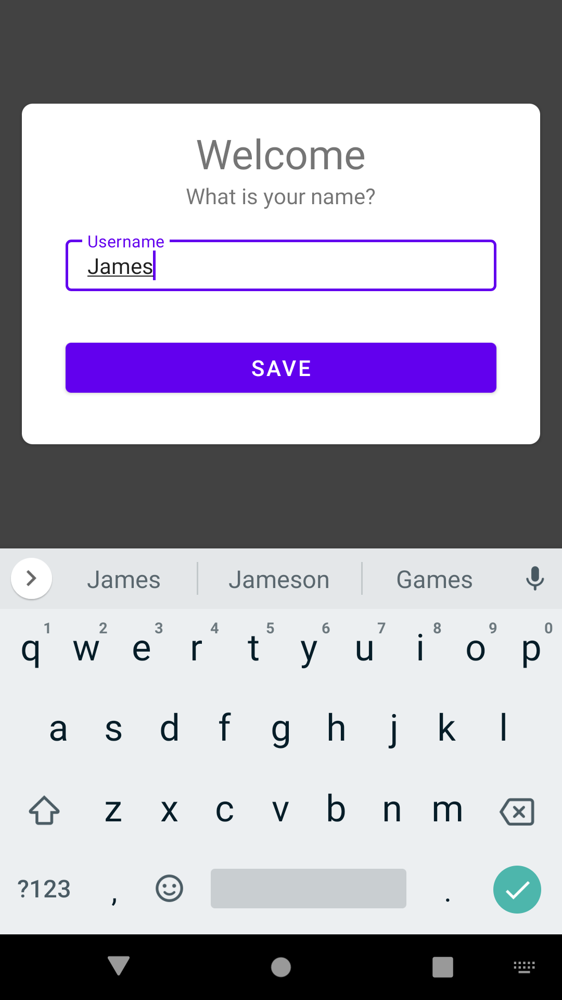

# Starter code for DFlag Android Application



This Android app uses two components:

- `android:windowSoftInputMode="adjustResize"`
- Card view from Material Design

## `android:windowSoftInputMode="adjustResize"`

The `android:windowSoftInputMode="adjustResize"` attribute is set on an activity to define how the `EditText` in a form and the soft keyboard should interact in case of potential overlap.

## Card View

The app uses the [Card View](https://developer.android.com/guide/topics/ui/layout/cardview) component from Material Design for visually appealing user interface elements.


## Android Layout

The app uses a `CardView`, which is a material design element for displaying items in a container that has a drop shadow and rounded edges.

### CardView

- The `CardView` has an `id` of `@+id/card_view`.
- `width` is set to `match_parent` and `height` to `wrap_content`.
- It is positioned `centerInParent` with a `margin` of `16dp`.
- The `background` color is set to white.
- The `elevation` is set to `8dp`.
- The `cardCornerRadius` is set to `8dp`.

### LinearLayout

- A `LinearLayout` with `width` set to `match_parent` and `height` to `wrap_content` is nested inside the `CardView`.
- `orientation` is set to `vertical` with `layout_margin` of `16dp`.

### TextView

- Two `TextView`s are nested inside the `LinearLayout`.
- The first `TextView` displays the text "Welcome" in size `30sp`.
- The second `TextView` displays the text "What is your name?" in size `16sp`.

### TextInputLayout and TextInputEditText

- A `TextInputLayout` with a `style` of `@style/Widget.MaterialComponents.TextInputLayout.OutlinedBox.Dense` is nested inside the `LinearLayout`.
- The `hint` attribute is set to `Username`.
- The `width` is set to `match_parent` and the `height` to `wrap_content`.
- A `TextInputEditText` is nested inside the `TextInputLayout`.
- `width` and `height` are set to `match_parent`.
- `padding` is set to `8dp` and `maxLength` to `15`.
- `singleLine` is set to `true`.

### Button

- A `Button` is nested inside the `LinearLayout`.
- `width` is set to `match_parent` and `height` to `wrap_content`.
- `margin` is set to `16dp` and the text size to `16sp`.
- The text displayed is "Save".


```xml 

 <!-- A CardView  -->
    <androidx.cardview.widget.CardView
        android:id="@+id/card_view"
        android:layout_width="match_parent"
        android:layout_height="wrap_content"
        android:layout_centerInParent="true"
        android:layout_margin="16dp"
        android:background="@color/white"
        android:elevation="8dp"
        card_view:cardCornerRadius="8dp">

        <LinearLayout
            android:layout_margin="16dp"
            android:layout_width="match_parent"
            android:layout_height="wrap_content"
            android:orientation="vertical">

            <TextView
                android:layout_width="wrap_content"
                android:layout_height="wrap_content"
                android:layout_gravity="center"
                android:text="Welcome"
                android:textSize="30sp" />

            <TextView
                android:layout_width="wrap_content"
                android:layout_height="wrap_content"
                android:layout_gravity="center"
                android:text="What is your name?"
                android:textSize="16sp" />

            <com.google.android.material.textfield.TextInputLayout
                style="@style/Widget.MaterialComponents.TextInputLayout.OutlinedBox.Dense"
                android:layout_width="match_parent"
                android:layout_height="wrap_content"
                android:layout_margin="16dp"
                android:hint="Username">

                <com.google.android.material.textfield.TextInputEditText
                    android:layout_width="match_parent"
                    android:layout_height="wrap_content"
                    android:padding="8dp"
                    android:maxLength="15"
                    android:singleLine="true" />

            </com.google.android.material.textfield.TextInputLayout>

            <Button
                android:layout_width="match_parent"
                android:layout_height="wrap_content"
                android:layout_margin="16dp"
                android:text="Save"
                android:textSize="16sp"/>

        </LinearLayout>
    </androidx.cardview.widget.CardView>
```

<hr/>


## Question
What is the purpose of `android:layout_centerInParent="true"` in the `CardView` element?

- A) It sets the center of the `CardView` to the center of its parent view.
- B) It aligns the `CardView` to the top-center of its parent view.
- C) It aligns the `CardView` to the bottom-center of its parent view.
- D) It sets the height of the `CardView` to match its parent view.

<details>
  <summary>Answer</summary>
  
A) It sets the center of the `CardView` to the center of its parent view.
  
</details>


